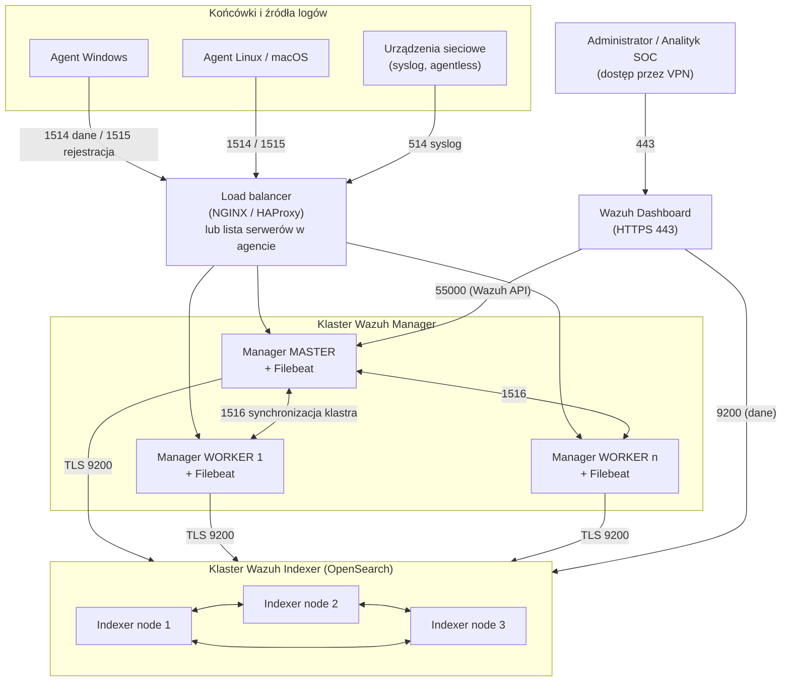
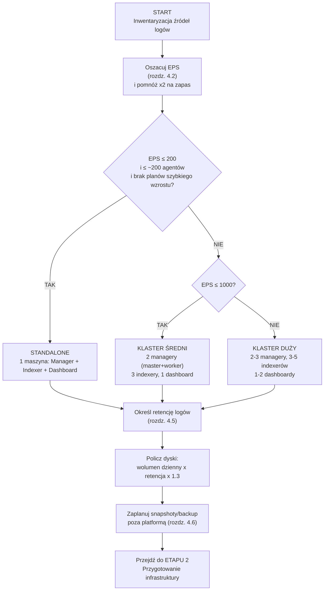
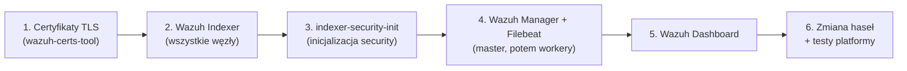

# Instrukcja wdrożeniowa platformy WAZUH

> **Wersja dokumentu:** 1.0 · **Data:** 2026-07-12
> **Zakres:** projekt architektury → przygotowanie infrastruktury → instalacja → klaster / wysoka dostępność → bezpieczeństwo platformy
> **Wersja odniesienia Wazuh:** gałąź 4.x (przykłady testowane na 4.9–4.14; w komendach stosuj zmienną `WAZUH_VERSION`)

---

## 1. Wprowadzenie

### 1.1 Cel dokumentu

Niniejsza instrukcja prowadzi administratora IT **krok po kroku przez pełne, produkcyjne wdrożenie platformy Wazuh** — od decyzji architektonicznych, przez przygotowanie infrastruktury i instalację komponentów, po konfigurację klastra wysokiej dostępności i zabezpieczenie samej platformy.

Dokument został napisany tak, aby:

- **osoba wdrażająca Wazuh po raz pierwszy** mogła przejść przez proces bez zewnętrznej pomocy,
- **doświadczony administrator** znalazł w nim gotowe wartości referencyjne (sizing, porty, konfiguracje) i listę pułapek, które najczęściej wydłużają wdrożenia,
- każdy etap kończył się **weryfikowalnym stanem** ("wiem, że działa, bo sprawdziłem X").

### 1.2 Jak korzystać z instrukcji

- Etapy wdrożenia (rozdziały 4–9) wykonuj **w kolejności** — każdy bazuje na poprzednim.
- Bloki `bash` / `yaml` / `xml` / `json` zawierają komendy i konfiguracje do bezpośredniego użycia. Wartości do podmiany oznaczono `<NAWIASAMI_OSTRYMI>` lub zmiennymi (`$NODE_NAME`).
- Ramki **⚠️ Uwaga** opisują błędy, które realnie zatrzymują wdrożenia — nie pomijaj ich.
- Rozdział 9 (**Troubleshooting**) zbiera objawy i rozwiązania — wróć do niego przy każdym nieoczekiwanym zachowaniu platformy.

### 1.3 Konwencje

| Oznaczenie | Znaczenie |
|---|---|
| `#` w bloku poleceń | polecenie wykonywane jako `root` (lub przez `sudo`) |
| `<IP_KOMPONENTU>` | wartość do podmiany na własną |
| ⚠️ **Uwaga** | częsty błąd / przypadek brzegowy |
| 💡 **Dobra praktyka** | zalecenie wykraczające poza minimum |
| ✅ **Punkt kontrolny** | weryfikacja poprawności etapu |

---

## 2. Architektura Wazuh — przegląd

Zanim podejmiesz decyzje projektowe, musisz rozumieć, z czego składa się platforma i jak przepływają w niej dane.

### 2.1 Komponenty

| Komponent | Rola | Kluczowe zasoby |
|---|---|---|
| **Wazuh Agent** | instalowany na końcówkach (serwery, stacje, VM, chmura); zbiera logi (Log Collector), monitoruje integralność plików (FIM), ocenia konfigurację (SCA), wykrywa podatności, wykonuje Active Response | znikome obciążenie hosta |
| **Wazuh Manager (Server)** | odbiera dane od agentów (usługa `remoted`), dekoduje zdarzenia i dopasowuje reguły (`analysisd`), zarządza agentami; w klastrze pracuje jako **master** lub **worker**; razem z nim instalowany jest **Filebeat**, który wysyła alerty do Indexera | CPU (parsowanie reguł), RAM (kolejki) |
| **Wazuh Indexer** | silnik indeksująco-wyszukujący oparty na **OpenSearch**; przechowuje alerty i archiwa w indeksach dziennych podzielonych na **shardy** | RAM (heap JVM) + **szybkie dyski (SSD/NVMe)** — to wydajnościowy "killer" platformy |
| **Wazuh Dashboard** | interfejs WWW (port 443) — wizualizacja, zarządzanie agentami, konfiguracja bezpieczeństwa; jest **klientem** Indexera i API Managera | niewielkie; jeden dashboard obsłuży nawet bardzo dużą infrastrukturę |

> **Kontekst historyczny (ważny przy czytaniu starszych materiałów):** Wazuh wywodzi się z projektu OSSEC (host IDS). Do wersji 4.6 backendem był Elastic Search + Kibana; obecnie jest to **OpenSearch** (Indexer) i **OpenSearch Dashboards** (Dashboard). Filebeat pozostał jako warstwa transportu Manager → Indexer — stąd w konfiguracji nadal spotkasz nazwy typu `output.elasticsearch` czy konto `kibanaserver`. To normalne.

### 2.2 Diagram architektury (wariant klastrowy)



W wariancie **standalone (all-in-one)** wszystkie trzy komponenty serwerowe (Manager, Indexer, Dashboard) stoją na jednej maszynie, a agenci łączą się bezpośrednio z jej adresem.

### 2.3 Przepływ danych (potok analizy)

1. Agent (lub urządzenie syslog) wysyła zdarzenia do Managera (usługa `remoted`, port 1514).
2. `analysisd` przetwarza zdarzenie w trzech fazach: **pre-decoding** (timestamp, hostname), **decoding** (rozbicie na pola, np. użytkownik, źródłowy adres IP), **rule matching** (dopasowanie do ~4500 wbudowanych reguł).
3. Zdarzenie, które trafiło w regułę → `alerts.json`; pozostałe (opcjonalnie) → `archives.json` w `/var/ossec/logs/`.
4. **Filebeat** czyta `alerts.json` i wysyła dane po TLS do **Indexera** (indeksy dzienne `wazuh-alerts-4.x-RRRR.MM.DD`).
5. **Dashboard** odpytuje Indexer (dane) i API Managera (zarządzanie).

### 2.4 Tabela portów (do reguł firewalla)

| Port | Protokół | Kierunek | Zastosowanie |
|---|---|---|---|
| **1514** | TCP (opcjonalnie UDP) | agent → manager | przesyłanie zdarzeń (szyfrowane AES) |
| **1515** | TCP | agent → manager | rejestracja/enrollment agenta (TLS); w klastrze **zawsze do mastera** |
| **1516** | TCP | manager ↔ manager | synchronizacja klastra managerów |
| **514** | UDP/TCP | urządzenie → manager | syslog (tryb agentless); **domyślnie wyłączony** |
| **9200** | TCP | manager/dashboard → indexer | REST API Indexera (TLS) |
| **9300–9400** | TCP | indexer ↔ indexer | komunikacja wewnętrzna klastra Indexerów |
| **55000** | TCP | dashboard/integracje → manager | Wazuh API (REST, TLS) |
| **443** | TCP | administrator → dashboard | interfejs WWW |

⚠️ **Uwaga:** nie używaj portu 443 do komunikacji agentów z managerem — to port zarezerwowany dla Dashboardu, a mieszanie ruchu agentów z ruchem HTTPS "zrobi sieczkę" na firewallu i utrudni analizę. Agenci zostają na 1514.

---

## 3. Wymagania wstępne (Prerequisites)

Przed rozpoczęciem etapu 1 upewnij się, że dysponujesz:

- [ ] **Systemem operacyjnym dla serwerów:** wyłącznie Linux — wspierane rodziny: Ubuntu/Debian (pakiety DEB), RHEL/Rocky/AlmaLinux/Amazon Linux (RPM). Architektury x86_64 oraz ARM (od 4.12). *Serwera Wazuh nie zainstalujesz na Windows.*
- [ ] **Dostępem `root`/`sudo`** do wszystkich maszyn.
- [ ] **Inwentaryzacją źródeł logów:** liczba serwerów Windows/Linux, stacji roboczych, urządzeń sieciowych (firewalle/UTM), planowane integracje — będzie potrzebna do szacowania EPS (rozdz. 4.2).
- [ ] **Decyzją o retencji logów** uzgodnioną z działem compliance (RODO / NIS2 / wymagania regulatora — patrz rozdz. 4.5).
- [ ] **Miejscem na backup/snapshoty** poza serwerami Wazuh (rozdz. 4.6).
- [ ] **Siecią zarządzania lub VPN** dla dostępu administracyjnego (rozdz. 5.6).
- [ ] Otwartymi w sieci portami z tabeli 2.4 (pomiędzy odpowiednimi strefami).
- [ ] Przeglądarką z dostępem do adresu przyszłego Dashboardu.

💡 **Dobra praktyka:** wszystkie hasła i klucze generowane podczas wdrożenia od razu zapisuj w firmowym menedżerze haseł (np. sejf zespołowy). W trakcie instalacji powstaje ich kilkanaście.

---

## 4. ETAP 1 — Projekt architektury Wazuh

Ten etap wykonujesz "na papierze", zanim utworzysz pierwszą maszynę. Błędy popełnione tutaj (za mało indexerów, wolne dyski, brak polityki retencji) są najdroższe w naprawie.

### 4.1 Decyzja: jeden serwer czy klaster?

Kryterium decyzji są **dwa progi**: liczba agentów oraz strumień zdarzeń **EPS** (Events Per Second).

| Środowisko | EPS | Liczba agentów (orientacyjnie) | Managery | Indexery | Dashboardy | Architektura |
|---|---|---|---|---|---|---|
| Małe | do ~200 | do ~150–200 | 1 | 1 | 1 | **standalone (all-in-one)** |
| Średnie | 200–1000 | setki | 2 (master + worker) | **3** | 1 | klaster |
| Duże | > 1000 | tysiące | 2–3 | 3–5 | 1 (opcjonalnie 2) | klaster |

Zasady, które warto znać przy podejmowaniu decyzji:

- **Standalone realnie obsłuży do ~200 końcówek.** Na bardzo mocnej maszynie "dociągnie" do ~500, ale przestaje być efektywny — wyszukiwania i dashboard wyraźnie zwalniają.
- **Minimum 3 indexery w klastrze** — to nie kaprys, lecz wymóg **kworum**: przy dwóch węzłach klaster OpenSearch nie rozstrzygnie, kto jest nadrzędny po awarii łącza (ryzyko split-brain).
- Jeśli organizacja **rośnie**, projektuj od razu klaster — konwersja standalone → klaster jest możliwa, ale wymaga regeneracji certyfikatów i przestoju.
- Dashboard praktycznie zawsze wystarczy **jeden** — zamiast stawiać drugą instancję "dla zarządu", lepiej rozdzielić uprawnienia rolami (rozdz. 8).

#### Flowchart decyzyjny



### 4.2 Szacowanie EPS — metoda praktyczna

Przemnóż liczbę urządzeń przez typowe wartości EPS, zsumuj i **pomnóż wynik ×2** (zapas na rozwój, nowe integracje i wymagania NIS2):

| Typ źródła | EPS na urządzenie |
|---|---|
| Serwer Windows | 5–20 (z rozbudowanym audytem/Sysmon nawet 30) |
| Stacja robocza Windows | 5–10 |
| Serwer/stacja Linux | 1–5 |
| Firewall / UTM (FortiGate, Palo Alto itp.) | **50–300** (zależnie od liczby reguł logujących) |

**Przykład:** 20 serwerów Windows (×15 = 300) + 100 stacji Windows (×8 = 800) + 30 serwerów Linux (×3 = 90) + 2 UTM (×150 = 300) = **1490 EPS** → ×2 = **~3000 EPS** → środowisko duże, klaster z 3–5 indexerami.

### 4.3 Określenie liczby maszyn — architektury referencyjne

**Wariant A — standalone (środowisko małe):**

| Maszyna | Komponenty |
|---|---|
| `wazuh-aio` | Manager + Indexer + Dashboard + Filebeat |

**Wariant B — klaster minimalny (środowisko średnie), 6 maszyn:**

| Maszyna | Komponenty |
|---|---|
| `wazuh-master-1` | Manager (master) + Filebeat |
| `wazuh-worker-1` | Manager (worker) + Filebeat |
| `wazuh-indexer-1..3` | Wazuh Indexer (3 maszyny) |
| `wazuh-dashboard` | Dashboard (na tej maszynie wygodnie też generować certyfikaty) |

**Wariant B-kompakt — klaster skonsolidowany (środowisko średnie), 3 maszyny:** gdy liczba serwerów jest dla klienta barierą, role można łączyć — wysoka dostępność obu warstw i kworum indexerów pozostają zachowane:

| Maszyna | Komponenty | Uwaga |
|---|---|---|
| `wazuh-node-1` | Manager (master) + Filebeat + Indexer + Dashboard | zasoby zsumowane |
| `wazuh-node-2` | Manager (worker) + Filebeat + Indexer | zasoby zsumowane |
| `wazuh-node-3` | Indexer | dopełnia kworum (3 węzły) |

Zasady konsolidacji:

- **węzły Indexera zawsze na osobnych fizycznych hostach** — dwa procesy Indexera na jednej maszynie to fikcja HA (awaria hosta zabiera i shard, i jego replikę),
- **master i worker Managera rozdzielone** — z tego samego powodu,
- zasoby współdzielonych maszyn **sumujemy** (Manager + Indexer + ew. Dashboard),
- certyfikaty per komponent w osobnych katalogach (`/etc/wazuh-indexer/certs`, `/etc/filebeat/certs`, `/etc/wazuh-dashboard/certs`) — łatwo je pomylić na wspólnym hoście,
- Dashboard jest lekki — może stać na dowolnym z węzłów.

Kompromis: mniej maszyn = mniejszy zapas wydajności (Indexer konkuruje z Managerem o RAM/dyski) i trudniejszy troubleshooting. Przy skali "dużej" (>1000 EPS) wracaj do pełnej separacji komponentów.

**Wariant C — multi-site (dwie lokalizacje), 7+ maszyn:** po jednym (lub dwa) managerze na lokalizację, indexery obu lokalizacji spięte w **jeden wspólny klaster**, jeden centralny dashboard dla SOC. Rozdzielność danych między lokalizacjami realizuje się osobnymi wzorcami indeksów (np. `site-a-alerts-*`, `site-b-alerts-*`).

💡 **Dobra praktyka:** przy skali "średniej+" preferuj pełną separację Managera i Indexera — Indexer nie konkuruje wtedy z Managerem o RAM i dyski, a troubleshooting certyfikatów jest prostszy (osobne katalogi, osobne maszyny). Wariant kompaktowy traktuj jako świadomy kompromis kosztowy, nie jako domyślny wybór.

### 4.4 Określenie zasobów CPU / RAM / dysk

Co konsumuje każdy zasób:

- **CPU** → parsowanie i dopasowywanie reguł (Manager) oraz indeksowanie (Indexer),
- **RAM** → kolejki Managera i przede wszystkim **heap JVM Indexera** (OpenSearch operuje na RAM),
- **Dysk** → indeksy i shardy — **wymagane SSD/NVMe** (ewentualnie szybki SAS 10–15k); HDD w Indexerze to gwarantowany problem wydajnościowy.

**Przeliczniki referencyjne:**

| Wielkość | Wartość |
|---|---|
| 1 EPS | ≈ 0,5–1 KB/s danych |
| 100 EPS | ≈ 4–8 GB logów **dziennie** (więcej przy Windows+Sysmon, mniej przy syslogu z Linuksa) |
| 100 EPS | ≈ 1 vCPU dla **Managera**; 1–2 vCPU dla **Indexera** |
| Narzut indeksowania | wolumen surowy × **1,3** |
| Heap JVM Indexera | 50% RAM maszyny, ale **nigdy więcej niż 32 GB** (powyżej Garbage Collector "ubija" system) |

**Wzór na dysk Indexera:**

```
pojemność = wolumen_dzienny(GB) × retencja(dni) × 1,3  (+ zapas 20–30%)
```

**Przykładowe konfiguracje maszyn:**

| Scenariusz | vCPU | RAM | Dysk |
|---|---|---|---|
| Lab / PoC (do 25 agentów) | 4 | 8 GB | 50 GB (90 dni retencji) |
| Standalone produkcyjny (~100–200 agentów) | 8 | 16 GB | wg wzoru (typowo 0,5–2 TB) |
| Węzeł klastra przy ~1000 EPS łącznie | 8 | 32 GB | 4–6 TB SSD (suma na klaster, dzielona przez węzły) |

⚠️ **Najczęstsze błędy sizingu** (z realnych wdrożeń): za mało indexerów (klaster "siada" pod obciążeniem), dyski HDD zamiast SSD, brak polityki retencji (dysk zapełnia się do 100% — patrz rozdz. 10.3), heap JVM > 32 GB.

### 4.5 Określenie retencji logów

- **Punkt wyjścia: 90 dni** danych "online" (przeszukiwalnych w Dashboardzie) — to typowy standard operacyjny SOC.
- Regulacje (NIS2, wymagania sektorowe, umowy z klientami) często wymagają **do 2 lat** — nie oznacza to jednak 2 lat na drogich dyskach NVMe.
- Zastosuj **tiering (hot/warm/cold)** i politykę **ISM** (Index State Management) w Indexerze:

| Tier | Dane | Nośnik | Typowy wiek |
|---|---|---|---|
| **hot** | świeże, intensywnie przeszukiwane | NVMe/SSD | 0–7 dni |
| **warm** | starsze, przeszukiwane sporadycznie | SATA/wolniejszy SAS | 7–30 dni |
| **cold** | archiwum na potrzeby audytu | tani storage, obiektowy, taśma | 30 dni – 2 lata |
| **delete** | po upływie retencji | — | automatyczne usunięcie (ISM) |

Konfigurację polityki ISM wykonasz po instalacji (przykład gotowej polityki znajdziesz w rozdz. 8.7.1); na etapie projektu **zapisz w dokumentacji uzgodnione wartości** (ile dni hot/warm/cold, po ilu dniach delete).

⚠️ **Uwaga:** indeksy tworzone są **codziennie od nowa** (`wazuh-alerts-4.x-RRRR.MM.DD`). Polityka retencji musi więc działać na wzorcu (`wazuh-alerts-*`), a nie na pojedynczym indeksie.

### 4.6 Określenie miejsca na snapshoty / backup

Zasady nadrzędne:

1. **Replika ≠ backup.** Repliki shardów w klastrze to odpowiednik RAID — chronią przed awarią węzła, nie przed skasowaniem danych, błędem ludzkim czy ransomware.
2. Backup trzymaj **poza platformą Wazuh** (osobny serwer / storage), najlepiej w formule **append-only / immutable** (np. Borg backup na zdalny serwer w trybie append-only, storage obiektowy z Object Lock/WORM, taśmy dla archiwum długoterminowego).
3. Backupuj **dane nieodtwarzalne**: indeksy (snapshoty Indexera) oraz konfigurację i klucze (Manager: `/var/ossec/etc`, w tym `client.keys`, certyfikaty, własne reguły). Sam system operacyjny i pakiety są odtwarzalne — najlepiej trzymać konfigurację jako kod (Ansible; oficjalne repozytorium `wazuh-ansible` zawiera gotowe role).
4. **Backup nietestowany = brak backupu.** Zaplanuj cykliczny test odtworzenia.

**Ile miejsca zarezerwować:** minimum 1× wielkość danych hot+warm dla snapshotów Indexera + kilkaset MB na konfiguracje. Przy wymaganiach dowodowych (integralność materiału dla organów) dodaj niezależny strumień kopii na storage typu WORM.

✅ **Punkt kontrolny etapu 1:** masz zatwierdzony dokument projektowy zawierający: wariant architektury (A/B/C), listę maszyn z zasobami, wyliczenie EPS i pojemności dysków, wartości retencji per tier oraz lokalizację backupów.

---

## 5. ETAP 2 — Przygotowanie infrastruktury

### 5.1 Utworzenie maszyn VM

1. Utwórz maszyny zgodnie z tabelą z etapu 1 (wspierane hipernadzorcy: VMware ESXi/Workstation, Hyper-V, Proxmox, VirtualBox; dostępny jest też gotowy obraz OVA — pamiętaj o przeskalowaniu jego domyślnych zasobów 4 vCPU / 8 GB / 50 GB).
2. Zainstaluj wspierany system (zalecane: Ubuntu LTS lub Rocky/AlmaLinux).
3. **Nadaj każdej maszynie unikalny hostname** — natychmiast, przed instalacją czegokolwiek:

```bash
hostnamectl set-hostname wazuh-indexer-1
exec bash   # odświeżenie powłoki, aby przyjęła nową nazwę
```

⚠️ **Uwaga:** maszyna z hostname `localhost` to klasyczna pułapka — agent Linux o nazwie `localhost` nie podłączy się poprawnie (konflikt nazw), a w klastrze nazwy węzłów muszą być rozróżnialne.

4. Zaktualizuj system i zainstaluj narzędzia bazowe:

```bash
apt update && apt upgrade -y && apt install -y curl nano tar gnupg
```

5. Dla maszyn Indexera ustaw parametr jądra wymagany przez OpenSearch:

```bash
echo "vm.max_map_count=262144" >> /etc/sysctl.conf
sysctl -p
```

💡 **Dobra praktyka:** dla Indexera wydziel **osobną partycję/wolumen na dane** (`/var/lib/wazuh-indexer`). Zapełnienie partycji systemowej przez indeksy potrafi zablokować API i usługi całej platformy.

### 5.2 Konfiguracja DNS

- Utwórz w wewnętrznym DNS rekordy A dla wszystkich maszyn (`wazuh-master-1.firma.local` itd.).
- **Agentom podawaj FQDN managera zamiast IP** — przy awarii lub migracji managera wystarczy podmienić rekord DNS, zamiast rekonfigurować setki agentów.
- W konfiguracjach klastra możesz używać FQDN lub IP — jeśli FQDN, wewnętrzny DNS staje się zależnością krytyczną (zapewnij mu redundancję).

⚠️ **Uwaga:** jeżeli DNS w organizacji bywa zawodny, w plikach konfiguracyjnych klastra (indexer ↔ indexer, manager ↔ manager) użyj adresów IP, a FQDN zostaw tylko dla agentów i dostępu administracyjnego.

### 5.3 Konfiguracja NTP

Synchronizacja czasu jest **krytyczna**: rozjazd zegarów psuje korelację zdarzeń, ważność certyfikatów TLS i spójność indeksów dziennych.

```bash
apt install -y chrony
# w /etc/chrony/chrony.conf wskaż firmowe serwery NTP:
#   server ntp1.firma.local iburst
#   server ntp2.firma.local iburst
systemctl enable --now chrony
chronyc tracking          # weryfikacja: offset rzędu milisekund
```

Wykonaj na **każdej** maszynie platformy. Docelowo również agenci powinni mieć poprawny czas (GPO / konfiguracja systemowa).

### 5.4 Konfiguracja firewalli

Zaimplementuj zasadę najmniejszego dostępu w oparciu o tabelę portów (rozdz. 2.4):

- sieć agentów → managery: **1514, 1515** (1515 w klastrze tylko do mastera, jeśli nie używasz load balancera),
- managery ↔ managery: **1516**,
- managery → indexery: **9200**,
- indexery ↔ indexery: **9200, 9300–9400**,
- dashboard → indexery: **9200**; dashboard → master: **55000**,
- sieć administracyjna/VPN → dashboard: **443**; → SSH: **22**.

Przykład (iptables, maszyna managera):

```bash
# NAJPIERW reguła dla połączeń ustanowionych — inaczej zerwiesz własną sesję SSH!
iptables -A INPUT -m state --state ESTABLISHED,RELATED -j ACCEPT
iptables -A INPUT -i lo -j ACCEPT
iptables -A INPUT -p tcp --dport 22    -s <SIEC_ADMIN>    -j ACCEPT
iptables -A INPUT -p tcp --dport 1514  -s <SIEC_AGENTOW>  -j ACCEPT
iptables -A INPUT -p tcp --dport 1515  -s <SIEC_AGENTOW>  -j ACCEPT
iptables -A INPUT -p tcp --dport 1516  -s <SIEC_KLASTRA>  -j ACCEPT
iptables -A INPUT -p tcp --dport 55000 -s <IP_DASHBOARDU> -j ACCEPT
iptables -P INPUT DROP
iptables -P FORWARD DROP
iptables -P OUTPUT ACCEPT
```

⚠️ **Uwaga (przypadek brzegowy):** wklejenie polityki `INPUT DROP` **przed** regułą `ESTABLISHED,RELATED` natychmiast odcina Twoją sesję SSH. Zachowaj kolejność jak wyżej i miej dostęp konsolowy (out-of-band) na wypadek pomyłki.

⚠️ **Uwaga (SELinux):** na systemach RHEL-owych z aktywnym SELinux dodaj porty do kontekstu, inaczej usługi zostaną zablokowane:

```bash
semanage port -a -t wazuh_port_t -p tcp 1514
restorecon -RFvv /var/ossec/
```

### 5.5 Przygotowanie kont administracyjnych

- Utwórz **imienne konta systemowe** z `sudo` dla każdego administratora (rozliczalność); nie pracuj na współdzielonym `root`.
- Utwardź SSH na wszystkich maszynach platformy:

```bash
# /etc/ssh/sshd_config
PermitRootLogin prohibit-password
PubkeyAuthentication yes
PasswordAuthentication no
```

- Konta do samej aplikacji Wazuh (Admin/SOC/Audytor) utworzysz w etapie 5 (rozdz. 8) — na razie zaplanuj, **kto** ma jaką rolę pełnić.

💡 **Dobra praktyka:** wpisane w konsolę hasła zostają w historii powłoki. Wrażliwe operacje wykonuj tak, by hasło nie było argumentem polecenia, a po pracach wyczyść historię (`history -c`).

### 5.6 Dostęp administracyjny przez VPN / sieć wewnętrzną

**Żaden komponent Wazuh nie może być wystawiony bezpośrednio do internetu.** Dotyczy to w szczególności Dashboardu (443), API (55000) i Indexera (9200), ale także portów agentowych — w przeszłości publicznie wystawiony port 1514 był wektorem ataku RCE na platformę.

- Dostęp administracyjny (SSH, Dashboard) realizuj **wyłącznie** z sieci zarządzania lub przez VPN (zalecany **WireGuard** — lekki i prosty w utrzymaniu).
- Agenci spoza sieci firmowej (laptopy zdalne, oddziały) → tunel VPN site-to-site/klientowy albo **mTLS** (certyfikat kliencki dla agenta) — nigdy "goły" port na publicznym IP.
- Nie binduj usług na `0.0.0.0`, jeśli maszyna ma interfejs publiczny — wskazuj konkretny adres wewnętrzny (przykłady w rozdz. 7).

✅ **Punkt kontrolny etapu 2:** wszystkie maszyny utworzone, unikalne hostname, czas zsynchronizowany (`chronyc tracking`), rekordy DNS rozwiązują się poprawnie, firewalle przepuszczają wymagane porty między strefami (sprawdź np. `nc -zv <IP> 9200`), dostęp administracyjny działa wyłącznie przez VPN/sieć zarządzania.

---

## 6. ETAP 3 — Instalacja Wazuh

Instalację opisujemy w dwóch wariantach:

- **Wariant A — standalone (all-in-one)**: jedna maszyna, instalator asystowany. Idealny dla środowisk małych i PoC.
- **Wariant B — dystrybuowany**: osobne maszyny, komponent po komponencie. Wykonasz go w środowiskach klastrowych (i kontynuujesz w etapie 4).

W obu wariantach ustaw najpierw zmienną wersji:

```bash
export WAZUH_VERSION=4.14
```

⚠️ **Uwaga:** skrypty instalacyjne pobierasz z internetu — **przejrzyj je przed uruchomieniem** (higiena łańcucha dostaw). Dodatkowo instalator odmawia pracy na maszynach z publicznym adresem IP (komunikat "The IP is public") — to celowe zabezpieczenie; produkcyjnie używaj adresacji prywatnej.

### 6.1 Wariant A — instalacja standalone (assisted)

```bash
curl -sO https://packages.wazuh.com/$WAZUH_VERSION/wazuh-install.sh
# przejrzyj skrypt:
less wazuh-install.sh
bash ./wazuh-install.sh -a
```

Parametr `-a` (all-in-one) instaluje kolejno: **certyfikaty TLS → Indexer → Manager (+Filebeat) → Dashboard** i na końcu wypisuje dane logowania:

```
INFO: You can access the web interface https://<IP>
    User: admin
    Password: <WYGENEROWANE_HASLO>
```

Zapisz hasło w menedżerze haseł. Przejdź do rozdz. 6.3 (zmiana haseł) i 6.4 (testy).

### 6.2 Wariant B — instalacja dystrybuowana krok po kroku

Kolejność jest nienegocjowalna: **(1) certyfikaty → (2) wszystkie Indexery → (3) inicjalizacja security → (4) Managery + Filebeat → (5) Dashboard.** Indexer musi działać, zanim uruchomisz Filebeat i Dashboard.



#### 6.2.1 Krok 1 — certyfikaty TLS dla wszystkich komponentów

Certyfikaty generujesz **raz, na jednej maszynie** (wygodnie: przyszły dashboard), dla całej platformy.

```bash
curl -sO https://packages.wazuh.com/$WAZUH_VERSION/wazuh-certs-tool.sh
curl -sO https://packages.wazuh.com/$WAZUH_VERSION/config.yml
```

Wypełnij `config.yml` — **nazwy węzłów muszą być dokładnie tymi, których użyjesz później w konfiguracjach** (opensearch.yml, ossec.conf):

```yaml
nodes:
  indexer:
    - name: wazuh-indexer-1
      ip: "10.0.10.11"
    - name: wazuh-indexer-2
      ip: "10.0.10.12"
    - name: wazuh-indexer-3
      ip: "10.0.10.13"
  server:
    - name: wazuh-master-1
      ip: "10.0.10.21"
      node_type: master
    - name: wazuh-worker-1
      ip: "10.0.10.22"
      node_type: worker
  dashboard:
    - name: wazuh-dashboard
      ip: "10.0.10.31"
```

> Przy **jednym** managerze pomiń pole `node_type`. Przy dwóch i więcej — oznaczenie `master`/`worker` jest obowiązkowe.

Wygeneruj i spakuj certyfikaty:

```bash
bash ./wazuh-certs-tool.sh -A
tar -cvf ./wazuh-certificates.tar -C ./wazuh-certificates/ .
```

Powstaje m.in.: `root-ca.pem` (i klucz), po parze `<nazwa-węzła>.pem`/`<nazwa-węzła>-key.pem` dla każdego komponentu oraz `admin.pem`/`admin-key.pem` (certyfikat administracyjny Indexera).

Rozprowadź archiwum na wszystkie maszyny:

```bash
scp ./wazuh-certificates.tar root@10.0.10.11:/root/
# ... i analogicznie na pozostałe węzły
```

⚠️ **Uwaga:**
- Certyfikaty są domyślnie ważne **3650 dni (10 lat)** — dla zgodności z NIS2/polityką PKI rozważ skrócenie i wpisz datę ważności do dokumentacji (samo nie wygaśnie "z alarmem"; patrz rozdz. 10.9).
- Skrypty generujące to rozwiązanie wygodne, ale w organizacjach z własnym **PKI** certyfikaty powinny pochodzić z firmowego CA (możesz podać własne CA do podpisu; do lekkiego, samodzielnego PKI z ACME warto rozważyć np. Smallstep CA).

#### 6.2.2 Krok 2 — instalacja Wazuh Indexer (każdy węzeł)

Repozytorium pakietów (Debian/Ubuntu):

```bash
curl -s https://packages.wazuh.com/key/GPG-KEY-WAZUH | gpg --dearmor -o /usr/share/keyrings/wazuh.gpg
echo "deb [signed-by=/usr/share/keyrings/wazuh.gpg] https://packages.wazuh.com/4.x/apt/ stable main" \
  > /etc/apt/sources.list.d/wazuh.list
apt update && apt install -y wazuh-indexer
```

Edytuj `/etc/wazuh-indexer/opensearch.yml`:

```yaml
network.host: "10.0.10.11"            # KONKRETNY adres tego węzła — nie 0.0.0.0!
node.name: "wazuh-indexer-1"          # dokładnie jak w config.yml certyfikatów
cluster.name: "wazuh-cluster"

cluster.initial_master_nodes:
  - "wazuh-indexer-1"
  - "wazuh-indexer-2"
  - "wazuh-indexer-3"

discovery.seed_hosts:                  # MUSI być odkomentowane w klastrze!
  - "10.0.10.11"
  - "10.0.10.12"
  - "10.0.10.13"

path.data: /var/lib/wazuh-indexer
path.logs: /var/log/wazuh-indexer

plugins.security.nodes_dn:
  - "CN=wazuh-indexer-1,OU=Wazuh,O=Wazuh,L=California,C=US"
  - "CN=wazuh-indexer-2,OU=Wazuh,O=Wazuh,L=California,C=US"
  - "CN=wazuh-indexer-3,OU=Wazuh,O=Wazuh,L=California,C=US"
```

> Instalacja pojedynczego indexera: zostaw pojedyncze wpisy. Sekcja `nodes_dn` musi odpowiadać DN z wygenerowanych certyfikatów (przy narzędziu Wazuh: `OU=Wazuh,O=Wazuh,L=California,C=US`).

Ustaw heap JVM w `/etc/wazuh-indexer/jvm.options` (50% RAM, maks. 32 GB — obie wartości identyczne):

```
-Xms16g
-Xmx16g
```

Zainstaluj certyfikaty węzła:

```bash
NODE_NAME=wazuh-indexer-1
mkdir /etc/wazuh-indexer/certs
tar -xf /root/wazuh-certificates.tar -C /etc/wazuh-indexer/certs/ \
  ./$NODE_NAME.pem ./$NODE_NAME-key.pem ./admin.pem ./admin-key.pem ./root-ca.pem
mv -n /etc/wazuh-indexer/certs/$NODE_NAME.pem      /etc/wazuh-indexer/certs/indexer.pem
mv -n /etc/wazuh-indexer/certs/$NODE_NAME-key.pem  /etc/wazuh-indexer/certs/indexer-key.pem
chmod 500 /etc/wazuh-indexer/certs
chmod 400 /etc/wazuh-indexer/certs/*
chown -R wazuh-indexer:wazuh-indexer /etc/wazuh-indexer/certs
```

Uruchom:

```bash
systemctl daemon-reload
systemctl enable --now wazuh-indexer
```

Powtórz krok 2 na pozostałych węzłach Indexera (zmieniając `NODE_NAME`, `network.host`, `node.name`).

#### 6.2.3 Krok 3 — inicjalizacja security klastra Indexerów

Na **jednym** (dowolnym, zwykle pierwszym) węźle:

```bash
/usr/share/wazuh-indexer/bin/indexer-security-init.sh
```

✅ **Punkt kontrolny:**

```bash
curl -k -u admin:admin https://10.0.10.11:9200
curl -k -u admin:admin https://10.0.10.11:9200/_cat/nodes?v
curl -k -u admin:admin https://10.0.10.11:9200/_cluster/health?pretty
```

Oczekiwane: odpowiedź JSON z nazwą klastra `wazuh-cluster`, na liście `_cat/nodes` **wszystkie** węzły, `status` klastra `green`. (Daj węzłom kilkanaście sekund po starcie, zanim uznasz błędy API za problem.)

#### 6.2.4 Krok 4 — instalacja Wazuh Manager + Filebeat (master, potem workery)

Na maszynie managera (repozytorium jak wyżej):

```bash
apt install -y wazuh-manager filebeat
systemctl daemon-reload
systemctl enable --now wazuh-manager
```

Konfiguracja Filebeat:

```bash
curl -so /etc/filebeat/filebeat.yml \
  https://packages.wazuh.com/$WAZUH_VERSION/tpl/wazuh/filebeat/filebeat.yml
curl -so /etc/filebeat/wazuh-template.json \
  https://raw.githubusercontent.com/wazuh/wazuh/v$WAZUH_VERSION.0/extensions/elasticsearch/7.x/wazuh-template.json
chmod go+r /etc/filebeat/wazuh-template.json
curl -s https://packages.wazuh.com/4.x/filebeat/wazuh-filebeat-0.3.tar.gz | \
  tar -xvz -C /usr/share/filebeat/module
```

W `/etc/filebeat/filebeat.yml` wskaż **wszystkie** indexery (nazwa `output.elasticsearch` jest historyczna — tak ma być):

```yaml
output.elasticsearch:
  hosts: ["10.0.10.11:9200", "10.0.10.12:9200", "10.0.10.13:9200"]
  protocol: https
  username: ${username}
  password: ${password}
  ssl.certificate_authorities: ["/etc/filebeat/certs/root-ca.pem"]
  ssl.certificate: "/etc/filebeat/certs/filebeat.pem"
  ssl.key: "/etc/filebeat/certs/filebeat-key.pem"
```

Poświadczenia Filebeat trzymaj w **keystore** (nie w pliku jawnym):

```bash
filebeat keystore create
echo admin | filebeat keystore add username --stdin --force
echo admin | filebeat keystore add password --stdin --force   # po zmianie haseł zaktualizujesz
```

Certyfikaty Filebeat (na maszynie managera):

```bash
NODE_NAME=wazuh-master-1
mkdir /etc/filebeat/certs
tar -xf /root/wazuh-certificates.tar -C /etc/filebeat/certs/ \
  ./$NODE_NAME.pem ./$NODE_NAME-key.pem ./root-ca.pem
mv -n /etc/filebeat/certs/$NODE_NAME.pem     /etc/filebeat/certs/filebeat.pem
mv -n /etc/filebeat/certs/$NODE_NAME-key.pem /etc/filebeat/certs/filebeat-key.pem
chmod 500 /etc/filebeat/certs
chmod 400 /etc/filebeat/certs/*
systemctl enable --now filebeat
```

✅ **Punkt kontrolny:**

```bash
filebeat test output
```

Oczekiwane: dla każdego indexera `connection ... OK`, `TLS ... OK`, `talk to server ... OK`.

Powtórz na workerze (z jego `NODE_NAME`). Konfigurację klastra managerów (`<cluster>` w `ossec.conf`) wykonasz w etapie 4 — w środowisku jednomanagerowym pomijasz ją całkowicie.

#### 6.2.5 Krok 5 — instalacja Wazuh Dashboard

```bash
apt install -y wazuh-dashboard
```

Edytuj `/etc/wazuh-dashboard/opensearch_dashboards.yml`:

```yaml
server.host: "10.0.10.31"      # konkretny interfejs — nie 0.0.0.0
server.port: 443
opensearch.hosts:
  - "https://10.0.10.11:9200"
  - "https://10.0.10.12:9200"
  - "https://10.0.10.13:9200"
opensearch.ssl.verificationMode: certificate
```

Certyfikaty i start:

```bash
NODE_NAME=wazuh-dashboard
mkdir /etc/wazuh-dashboard/certs
tar -xf /root/wazuh-certificates.tar -C /etc/wazuh-dashboard/certs/ \
  ./$NODE_NAME.pem ./$NODE_NAME-key.pem ./root-ca.pem
mv -n /etc/wazuh-dashboard/certs/$NODE_NAME.pem     /etc/wazuh-dashboard/certs/dashboard.pem
mv -n /etc/wazuh-dashboard/certs/$NODE_NAME-key.pem /etc/wazuh-dashboard/certs/dashboard-key.pem
chmod 500 /etc/wazuh-dashboard/certs
chmod 400 /etc/wazuh-dashboard/certs/*
chown -R wazuh-dashboard:wazuh-dashboard /etc/wazuh-dashboard/certs
systemctl daemon-reload
systemctl enable --now wazuh-dashboard
```

Na koniec wskaż Dashboardowi API managera w `/usr/share/wazuh-dashboard/data/wazuh/config/wazuh.yml`:

```yaml
hosts:
  - default:
      url: https://10.0.10.21
      port: 55000
      username: wazuh-wui
      password: <HASLO_WAZUH_WUI>
      run_as: true
```

```bash
systemctl restart wazuh-dashboard
```

### 6.3 Zmiana haseł domyślnych

Po instalacji hasła wszystkich kont wewnętrznych znajdują się w pliku `wazuh-passwords.txt` (wewnątrz archiwum `wazuh-install-files.tar` przy instalacji asystowanej):

```bash
tar -axf wazuh-install-files.tar wazuh-install-files/wazuh-passwords.txt -O | less
```

Konta, które musisz znać:

| Konto | Warstwa | Rola |
|---|---|---|
| `admin` | Indexer/Dashboard | pełny administrator (konto wbudowane — patrz rozdz. 8.3) |
| `kibanaserver`, `kibanaro`, `filebeat` | Indexer | konta techniczne komponentów — nie loguj się nimi |
| `wazuh`, `wazuh-wui` | Wazuh API (55000) | konta API — `wazuh-wui` używa Dashboard |

**Zmiana wszystkich haseł jednym poleceniem** (zalecane od razu po instalacji):

```bash
bash /usr/share/wazuh-indexer/plugins/opensearch-security/tools/wazuh-passwords-tool.sh -a
```

Skrypt wygeneruje nowe hasła dla wszystkich kont i sam zaktualizuje je w komponentach (robi też backup użytkowników wewnętrznych). Pojedyncze konto: `wazuh-passwords-tool.sh -u admin -p '<NOWE_HASLO>'`.

Po zmianie haseł:

```bash
systemctl restart wazuh-manager wazuh-dashboard
```

⚠️ **Uwaga (bardzo częsty przypadek):** po `wazuh-passwords-tool.sh -a` Dashboard potrafi zgłaszać `Internal server error` mimo restartu usług — **wyczyść ciasteczka/cache przeglądarki** i zaloguj się ponownie.

⚠️ **Uwaga:** przy zmianie hasła konta `filebeat`/`admin` zaktualizuj **keystore Filebeat** na wszystkich managerach (rozdz. 6.2.4), inaczej alerty przestaną spływać do Indexera.

💡 **Dobre praktyki:**
- Po zapisaniu haseł w menedżerze haseł **usuń `wazuh-install-files.tar` z serwera** — to gotowy "prezent" dla atakującego.
- W klastrze narzędzie zmienia hasła na węźle, na którym je uruchomiono — zsynchronizuj konfigurację na pozostałe węzły.
- Instalacje Docker/OVA często mają hasła typu `admin/admin`, `SecretPassword` — **zmień je przed** podłączeniem pierwszego agenta.

### 6.4 Test działania platformy

Wykonaj kolejno:

**1. Usługi:**

```bash
systemctl status wazuh-indexer wazuh-manager filebeat wazuh-dashboard
```

**2. Indexer i klaster:**

```bash
curl -k -u admin:<HASLO> https://<IP_INDEXERA>:9200/_cluster/health?pretty   # status: green
curl -k -u admin:<HASLO> https://<IP_INDEXERA>:9200/_cat/indices/wazuh-*?v
```

**3. Potok Manager → Indexer:**

```bash
filebeat test output          # wszystkie pozycje OK
tail -n 50 /var/ossec/logs/ossec.log   # brak wpisów ERROR/CRITICAL
```

**4. Dashboard:** otwórz `https://<IP_DASHBOARDU>`, zaloguj się kontem `admin` (nowym hasłem). Ostrzeżenie przeglądarki o certyfikacie jest oczekiwane przy self-signed (możesz zaimportować `root-ca.pem` do zaufanych lub wystawić certyfikat z firmowego CA).

**5. Test end-to-end — podłącz pierwszego agenta:**

W Dashboardzie: *Server management → Endpoint Summary → Deploy new agent* → wybierz system i skopiuj wygenerowane polecenie, np. dla Ubuntu:

```bash
wget https://packages.wazuh.com/4.x/apt/pool/main/w/wazuh-agent/wazuh-agent_$WAZUH_VERSION.0-1_amd64.deb && \
  WAZUH_MANAGER='wazuh-master-1.firma.local' dpkg -i ./wazuh-agent_$WAZUH_VERSION.0-1_amd64.deb
systemctl daemon-reload && systemctl enable --now wazuh-agent
```

✅ **Punkt kontrolny etapu 3:** agent widoczny w Dashboardzie jako **Active**, w module *Threat Hunting/Discover* pojawiają się zdarzenia agenta, `_cluster/health` = `green`, wszystkie hasła domyślne zmienione, plik instalacyjny z hasłami usunięty.

---

## 7. ETAP 4 — Konfiguracja klastra / wysokiej dostępności

Ten etap zakłada, że masz zainstalowane komponenty według wariantu B (rozdz. 6.2). Składa się z czterech elementów: klaster Indexerów (7.1), klaster Managerów (7.2), kierowanie agentów (7.3) i Dashboard (7.4), po czym następują testy (7.5–7.6) i dokumentacja (7.7).

### 7.1 Klaster Indexerów — dokończenie (repliki!)

Sam klaster z rozdz. 6.2.2–6.2.3 replikuje metadane, ale **domyślnie indeksy Wazuh mają 3 shardy primary i 0 replik** — co oznacza, że **awaria jednego węzła powoduje utratę dostępności danych (klaster w stanie RED)**. Wysoka dostępność wymaga replik:

**1. Ustaw repliki dla nowych indeksów** — edytuj szablon `/etc/filebeat/wazuh-template.json` na managerach (sekcja `settings`):

```json
"settings": {
  "index.number_of_shards": 3,
  "index.number_of_replicas": 1
}
```

i przeładuj szablon:

```bash
filebeat setup --index-management
```

**2. Ustaw repliki dla istniejących indeksów** (Dashboard → *Indexer management → Dev Tools*):

```
PUT wazuh-alerts-*/_settings
{ "index": { "number_of_replicas": 1 } }
```

Zasady doboru:

- 1 węzeł → **0 replik** (replika bez drugiego węzła tylko wprowadza status `yellow`),
- 2–3 węzły → **1 replika** (minimum produkcyjne),
- większe klastry → 3–6 shardów primary i ≥2 repliki na indeks; nie mnóż shardów ponad potrzebę (każdy shard to narzut RAM/CPU).

✅ **Punkt kontrolny:**

```bash
curl -k -u admin:<HASLO> "https://<IP>:9200/_cat/shards/wazuh-alerts-*?v"
# każdy shard 'p' (primary) ma odpowiadający shard 'r' (replica) na INNYM węźle
curl -k -u admin:<HASLO> "https://<IP>:9200/_cluster/health?pretty"   # green
```

### 7.2 Klaster Managerów (master + workery)

**1. Wygeneruj wspólny klucz klastra** (na dowolnej maszynie):

```bash
openssl rand -hex 16
# przykład: c98b62a9b6169ac5f67dae55ae4a9088
```

Klucz jest **obowiązkowy i identyczny** na wszystkich węzłach — uwierzytelnia komunikację klastrową (nikt nie podepnie "obcego" managera).

**2. Konfiguracja MASTERA** — `/var/ossec/etc/ossec.conf`, sekcja `<cluster>`:

```xml
<cluster>
    <name>wazuh</name>
    <node_name>wazuh-master-1</node_name>
    <node_type>master</node_type>
    <key>c98b62a9b6169ac5f67dae55ae4a9088</key>
    <port>1516</port>
    <bind_addr>10.0.10.21</bind_addr>
    <nodes>
        <node>10.0.10.21</node>
    </nodes>
    <hidden>no</hidden>
    <disabled>no</disabled>
</cluster>
```

**3. Konfiguracja WORKERA** (każdego):

```xml
<cluster>
    <name>wazuh</name>
    <node_name>wazuh-worker-1</node_name>
    <node_type>worker</node_type>
    <key>c98b62a9b6169ac5f67dae55ae4a9088</key>
    <port>1516</port>
    <bind_addr>10.0.10.22</bind_addr>
    <nodes>
        <node>10.0.10.21</node>   <!-- ZAWSZE adres MASTERA, także na workerze -->
    </nodes>
    <hidden>no</hidden>
    <disabled>no</disabled>
</cluster>
```

Objaśnienia pól:

| Pole | Znaczenie |
|---|---|
| `name` | nazwa klastra — identyczna wszędzie |
| `node_name` | unikalna nazwa węzła (spójna z certyfikatami) |
| `node_type` | `master` (dokładnie jeden) / `worker` |
| `key` | wspólny klucz z kroku 1 |
| `nodes → node` | **adres mastera** — na wszystkich węzłach; **nigdy `0.0.0.0`** (workery próbowałyby łączyć się "donikąd") |
| `hidden` | `no` = alerty zawierają nazwę węzła, który je obsłużył (przydatne w diagnostyce) |
| `disabled` | `no` = klaster aktywny — łatwo przeoczyć! |

**4. Restart (najpierw master, potem workery):**

```bash
systemctl restart wazuh-manager
```

Master synchronizuje do workerów grupy agentów, konfigurację współdzieloną i stan; workery raportują keep-alive i statusy agentów. Rozbudowa klastra o kolejny węzeł sprowadza się do dołożenia workera z tym samym `name`/`key`.

✅ **Punkt kontrolny:**

```bash
/var/ossec/bin/cluster_control -l
```

Oczekiwane: lista wszystkich węzłów z rolami (`master`/`worker`) i adresami IP.

### 7.3 Kierowanie agentów: failover lub load balancer

**Opcja 1 — lista serwerów w konfiguracji agenta (failover):**

```xml
<client>
  <server>
    <address>10.0.10.22</address>   <!-- worker (najbliższy agentowi) — najwyższy priorytet -->
    <port>1514</port>
    <protocol>tcp</protocol>
  </server>
  <server>
    <address>10.0.10.23</address>   <!-- kolejny worker -->
    <port>1514</port>
    <protocol>tcp</protocol>
  </server>
  <server>
    <address>10.0.10.21</address>   <!-- master — "gateway of last resort" -->
    <port>1514</port>
    <protocol>tcp</protocol>
  </server>
</client>
```

Kolejność wpisów = priorytet. Po **3 nieudanych keep-alive** agent przechodzi do następnego serwera z listy; zaległe logi buforuje i dosyła po odzyskaniu łączności.

**Opcja 2 — load balancer (NGINX/HAProxy), zalecana przy setkach+ agentów:** agent dostaje **jeden adres** (LB), a rozkładem ruchu steruje konfiguracja balancera:

```nginx
stream {
    upstream wazuh_master {
        server 10.0.10.21:1515;              # rejestracja WYŁĄCZNIE do mastera
    }
    upstream wazuh_cluster {
        server 10.0.10.21:1514;              # dane: round-robin po całym klastrze
        server 10.0.10.22:1514;
        server 10.0.10.23:1514;
    }
    server { listen 1515; proxy_pass wazuh_master; }
    server { listen 1514; proxy_pass wazuh_cluster; }
}
```

⚠️ **Uwaga:** rejestracja agentów (port **1515**) musi zawsze trafiać do **mastera** — tylko on wydaje klucze. Dane (port **1514**) mogą iść na dowolny węzeł. Przy rozbudowie klastra pamiętaj o aktualizacji konfiguracji LB.

### 7.4 Dashboard w środowisku klastrowym

Wykonane już w rozdz. 6.2.5: `opensearch.hosts` zawiera **wszystkie** węzły Indexera — Dashboard sam przełączy się na działający węzeł przy awarii. Pojedynczy Dashboard to akceptowalny kompromis (nie bierze udziału w zbieraniu danych; jego awaria nie zatrzymuje platformy) — przy wymaganiu HA postaw drugą instancję z identyczną konfiguracją za reverse proxy.

### 7.5 Test komunikacji między węzłami

Wykonaj i **zapisz wyniki w dokumentacji** (to Twój stan odniesienia):

```bash
# 1. Klaster managerów — wszystkie węzły widoczne:
/var/ossec/bin/cluster_control -l

# 2. Klaster indexerów — wszystkie węzły, status green:
curl -k -u admin:<HASLO> "https://10.0.10.11:9200/_cat/nodes?v"
curl -k -u admin:<HASLO> "https://10.0.10.11:9200/_cluster/health?pretty"

# 3. Rozkład shardów i replik:
curl -k -u admin:<HASLO> "https://10.0.10.11:9200/_cat/shards/wazuh-alerts-*?v"

# 4. Transport Manager -> Indexer (na każdym managerze):
filebeat test output

# 5. Synchronizacja klastra managerów w logu:
grep -i cluster /var/ossec/logs/ossec.log | tail
```

### 7.6 Test awarii pojedynczego komponentu

Przeprowadź kontrolowane testy **przed** oddaniem platformy do produkcji (na środowisku z co najmniej jednym agentem testowym):

**Test 1 — awaria workera:**

```bash
# na workerze:
systemctl stop wazuh-manager
```

Oczekiwane: agenci wskazujący workera przełączają się (po 3 keep-alive, tj. ~kilkadziesiąt sekund) na następny serwer z listy / LB omija węzeł; alerty nadal spływają. Po `systemctl start wazuh-manager` węzeł wraca do klastra (`cluster_control -l`).

**Test 2 — awaria węzła Indexera:**

```bash
# na jednym z indexerów:
systemctl stop wazuh-indexer
```

Oczekiwane **przy skonfigurowanych replikach**: `_cluster/health` przechodzi w `yellow` (brakuje replik), ale zapis i odczyt działają — Dashboard dalej pokazuje świeże alerty. Po starcie węzła klaster automatycznie dosynchronizuje shardy i wraca do `green`.
Jeśli klaster przeszedł w **RED** — nie ustawiłeś replik (wróć do 7.1).

**Test 3 — awaria mastera:**

Oczekiwane: istniejący agenci **nadal wysyłają dane** do workerów (zbieranie działa), ale **rejestracja nowych agentów i zarządzanie grupami nie działa** do czasu przywrócenia mastera. To znane ograniczenie architektury — awarię mastera traktuj jako incydent priorytetowy (odtworzenie z backupu konfiguracji, rozdz. 4.6).

**Test 4 — awaria Dashboardu:** zbieranie i korelacja działają bez przerwy; brak tylko GUI. Weryfikacja: po restarcie Dashboardu alerty z okresu awarii są widoczne (bo trafiały do Indexera).

⚠️ **Uwaga:** każdy test wykonuj pojedynczo i czekaj na powrót do stanu `green` przed kolejnym.

### 7.7 Dokumentacja konfiguracji

Bez dokumentacji klaster jest utrzymywalny tylko przez osobę, która go stawiała. Minimum, które musi powstać (i być aktualizowane przy każdej zmianie):

| Element | Co zapisać |
|---|---|
| Topologia | diagram + tabela: hostname, IP, rola, lokalizacja, zasoby |
| Wersje | wersja Wazuh każdego komponentu, wersje OS |
| Certyfikaty | gdzie wygenerowane, CN/DN węzłów, **daty ważności**, lokalizacja `root-ca.key` (offline!) |
| Klucz klastra managerów | odnośnik do sejfu haseł (nie sam klucz!) |
| Konta i hasła | lista kont + odnośniki do sejfu |
| Konfiguracje | kopie/`git` plików: `ossec.conf`, `opensearch.yml`, `filebeat.yml`, `opensearch_dashboards.yml`, `wazuh.yml`, szablony indeksów |
| Polityki | retencja (ISM), repliki/shardy, harmonogram backupów |
| Wyniki testów | wyniki z 7.5 i 7.6 z datami |
| Procedury awaryjne | co robić przy awarii mastera / indexera / zapełnieniu dysku (odnośniki do rozdz. 10) |

💡 **Dobra praktyka:** trzymaj konfiguracje w repozytorium git (bez sekretów!) lub zarządzaj nimi Ansiblem — odtworzenie węzła sprowadza się wtedy do uruchomienia playbooka.

✅ **Punkt kontrolny etapu 4:** wszystkie testy 7.5–7.6 zaliczone, klaster `green`, dokumentacja utworzona i zaakceptowana.

---

## 8. ETAP 5 — Konfiguracja bezpieczeństwa platformy Wazuh

SIEM to najbardziej wartościowy cel w sieci — zawiera logi całej organizacji i (przez Active Response) potrafi wykonywać polecenia na końcówkach. Zabezpieczenie samej platformy nie jest opcją.

### 8.1 Ograniczenie dostępu do Dashboardu

1. **Sieciowo:** Dashboard (443) i API (55000) dostępne wyłącznie z sieci zarządzania / VPN (rozdz. 5.4, 5.6). Zero ekspozycji do internetu.
2. **Bind na konkretny interfejs** — `server.host` w `opensearch_dashboards.yml` ustawiony na adres w sieci zarządzania (zrobione w 6.2.5).
3. **Zaufany certyfikat:** wystaw certyfikat Dashboardu z firmowego CA (lub zaimportuj `root-ca.pem` platformy do zaufanych na stacjach adminów) — eliminujesz "klikanie wyjątków", które maskuje prawdziwe ataki MitM.
4. **Ogranicz rejestrację agentów** hasłem enrollmentu — bez tego każdy, kto sięga portu 1515, może zarejestrować "agenta" i pobrać współdzieloną konfigurację (cenny rekonesans dla atakującego):

```bash
echo "<TAJNE_HASLO_ENROLLMENTU>" > /var/ossec/etc/authd.pass
chmod 640 /var/ossec/etc/authd.pass
chown root:wazuh /var/ossec/etc/authd.pass
```

```xml
<!-- ossec.conf (manager), sekcja <auth> -->
<auth>
  <use_password>yes</use_password>
</auth>
```

Po zmianie: `systemctl restart wazuh-manager`. Agenci podają hasło przy instalacji (parametr `WAZUH_REGISTRATION_PASSWORD`).

### 8.2 Model uprawnień — dwie warstwy (kluczowe do zrozumienia)

Wazuh ma **dwa niezależne systemy uprawnień**, konfigurowane w dwóch różnych miejscach Dashboardu:

| Warstwa | Gdzie w GUI | Czym zarządza |
|---|---|---|
| **Indexer Security** (OpenSearch) | *Indexer management → Security* | logowanie do Dashboardu, dostęp do **indeksów/danych** (Internal users, Roles, Roles mapping) |
| **Wazuh API RBAC** | *Server management → Security* | uprawnienia do **API Managera** — zarządzanie agentami, grupami, konfiguracją (Roles, Policies, Roles mapping) |

Nowy użytkownik potrzebuje **obu**: konta i roli w Indexerze (żeby się zalogować i widzieć dane) oraz mapowania roli API (żeby cokolwiek zrobić w części "Wazuh" interfejsu).

**Warunek wstępny:** w `/usr/share/wazuh-dashboard/data/wazuh/config/wazuh.yml` musi być:

```yaml
run_as: true
```

(po zmianie `systemctl restart wazuh-dashboard`). Bez `run_as: true` Dashboard wykonuje wszystkie operacje w API jako techniczne konto `wazuh-wui` — Twoja matryca uprawnień per użytkownik nie zadziała, a audyt straci sens.

### 8.3 Konfiguracja kont: Administrator / SOC / Audytor

**Zasady ogólne:**

- Wbudowanego konta **`admin` nie usuwaj, nie zmieniaj mu nazwy i nie wyłączaj** — jest używane wewnętrznie przez komponenty. Potraktuj je jako **konto break-glass**: bardzo silne hasło w sejfie, użycie tylko awaryjne.
- Twórz **konta imienne** (np. `adm.jkowalski`, `soc.anowak`) — rozliczalność.
- Ról wbudowanych (`all_access`, `readonly`, itd.) **nie edytuj** — w razie potrzeby duplikuj.

#### 8.3.1 Konto Administratora (imienne)

1. *Indexer management → Security → Internal users → Create internal user* — np. `adm.jkowalski` + silne hasło.
2. Przypisz rolę: otwórz rolę `all_access` → *Duplicate* (np. `all_access_custom`) → *Mapped users → Manage mapping* → dodaj użytkownika. (Alternatywnie: nadaj użytkownikowi backend role `admin`, która mapuje się do `all_access` automatycznie.)
3. *Server management → Security → Roles mapping → Create* — np. `mapping_admins`: Roles = **`administrator`**, Internal users = `adm.jkowalski` → Save.
4. Przeloguj się na nowe konto i zweryfikuj pełny dostęp.

#### 8.3.2 Konto analityka SOC (read-only)

1. *Internal users* → np. `soc.anowak`.
2. *Roles → Create role* — np. `soc_readonly`:
   - **Cluster permissions:** `cluster_composite_ops_ro`
   - **Index permissions:** Index = `*`, uprawnienie `read`
   - **Tenant permissions:** `global_tenant` → *Read only*
   - każdy wpis zatwierdzaj **Enterem** (inaczej wartość nie zostanie dodana)
3. W roli: *Mapped users → Map* → `soc.anowak`.
4. *Server management → Security → Roles mapping* → Roles = **`readonly`**, Internal users = `soc.anowak`.

⚠️ **Uwaga:** kuszące zawężenie indeksów tylko do `wazuh-alerts-*` **psuje moduł Discover i część widoków** — Dashboard potrzebuje też `wazuh-monitoring-*`, `wazuh-statistics-*` i indeksów stanów. Zostaw `read` na `*` albo świadomie dodaj wszystkie wymagane wzorce.

#### 8.3.3 Konto Audytora (read-only + zawężenie zakresu danych)

Audytor zwykle ma widzieć dane tylko wybranego obszaru (np. grupy agentów objętej audytem). Wykorzystaj **Document Level Security (DLS)**:

1. Oznacz agentów etykietą grupy — w konfiguracji współdzielonej grupy agentów (*Endpoint Groups → (grupa) → Files → agent.conf*):

```xml
<agent_config>
  <labels>
    <label key="group">Audyt_2026</label>
  </labels>
</agent_config>
```

2. *Roles → Create role* — np. `audytor_zakres`:
   - Cluster: `cluster_composite_ops_ro`; Tenant: `global_tenant` Read only
   - Index `wazuh-alerts-*` → `read` + **Document level security**:

```json
{ "bool": { "must": { "match": { "agent.labels.group": "Audyt_2026" } } } }
```

3. Warstwa API (*Server management → Security*):
   - *Policies → Create policy*: `polityka_audyt` — Action `agent:read`, Resource `agent:group`, Identifier `Audyt_2026`, Effect `allow`;
   - *Roles → Create role*: `rola_audyt` + przypisz politykę;
   - *Roles mapping*: Roles = `rola_audyt` + `cluster_readonly`, Internal users = konto audytora.

Efekt: audytor loguje się do Dashboardu, widzi wyłącznie zdarzenia i agentów objętych audytem, niczego nie zmieni.

#### 8.3.4 Hardening API Managera

Plik `/var/ossec/api/configuration/api.yaml`:

```yaml
max_login_attempts: 5          # blokada po serii nieudanych logowań
block_time: 300                # czas blokady [s]
max_request_per_minute: 300
```

Skrócenie ważności tokenów JWT (domyślnie 900 s; wartość dobierz do polityki):

```bash
TOKEN=$(curl -s -u wazuh:<HASLO> -k -X POST "https://<IP_MASTERA>:55000/security/user/authenticate?raw=true")
curl -k -X PUT "https://<IP_MASTERA>:55000/security/config" \
  -H "Authorization: Bearer $TOKEN" -H "Content-Type: application/json" \
  -d '{"auth_token_exp_timeout": 900}'
```

### 8.4 Integracja z SSO / MFA (jeżeli przewidziana)

**Fakt projektowy:** Wazuh **nie ma natywnego MFA/TOTP**. Uwierzytelnianie wieloskładnikowe uzyskuje się wyłącznie przez **zewnętrznego dostawcę tożsamości (IdP)** — i to jest zalecany model docelowy dla produkcji:

| Metoda | Kiedy | Uwagi |
|---|---|---|
| **SAML** (Entra ID, Okta, Keycloak, Google Workspace) | organizacja ma IdP z MFA | MFA egzekwuje IdP; Wazuh dostaje potwierdzoną tożsamość + role |
| **LDAP / Active Directory** | brak IdP SAML, jest AD | prostsza konfiguracja; **wymuś TLS** (LDAP domyślnie nie szyfruje!) |
| Konta lokalne | małe środowiska / break-glass | brak MFA, sztywna polityka haseł |

**Szkic konfiguracji SAML (przykład: Microsoft Entra ID):**

1. W Entra: zarejestruj aplikację (np. "Wazuh SSO"), włącz protokół SAML, zdefiniuj role aplikacji (np. `wazuh_admins`, `wazuh_soc`) i przypisz do nich użytkowników/grupy; zanotuj metadane IdP i ustaw **Reply URL** (Assertion Consumer Service) na adres Dashboardu.
2. Po stronie Wazuh (konfiguracja security Indexera — plik `config.yml` pluginu security): dodaj `http_authenticator` typu `saml` z parametrami z metadanych IdP (entity ID, URL-e, certyfikat podpisu).
3. Zastosuj zmiany skryptem `securityadmin.sh` (przeładowanie konfiguracji security) i zrestartuj Dashboard.
4. Zmapuj role: *Roles mapping* → jako **backend role** podaj nazwę roli/grupy z IdP (np. `wazuh_soc` → rola `soc_readonly`). Każdy członek grupy w IdP automatycznie dostaje właściwe uprawnienia — bez ręcznego zakładania kont.
5. Przetestuj na koncie testowym **zanim** wyłączysz logowanie lokalne; zawsze zostaw lokalne konto break-glass (na wypadek awarii IdP).

**LDAP/AD:** w tej samej konfiguracji security aktywuj gotowy szablon LDAP: hosty AD, konto bind (readonly), `userbase` (`OU=...,DC=firma,DC=local`), wyszukiwanie po `sAMAccountName`, **`enable_ssl: true`**. Mapowanie grup AD → role przez backend roles, jak wyżej.

### 8.5 Audyt dostępu do Wazuh

Skonfiguruj rejestrowanie tego, **kto i co robił na samej platformie**:

**1. Audit log warstwy Indexer/Dashboard (logowania, zapytania, zmiany uprawnień)** — w `/etc/wazuh-indexer/opensearch.yml` na węzłach:

```yaml
plugins.security.audit.type: internal_opensearch
```

Po restarcie Indexerów zdarzenia audytowe (udane/nieudane logowania, brakujące uprawnienia, zmiany w security) trafiają do indeksu `security-auditlog-*`. Utwórz dla niego index pattern w Dashboardzie i **politykę retencji ISM** (rośnie szybko). Szczegółowe kategorie zdarzeń dostroisz w *Indexer management → Security → Audit logs*.

**2. Audyt API Managera:** operacje przez API (zarządzanie agentami, zmiany konfiguracji) są logowane w `/var/ossec/logs/api.log` — dzięki `run_as: true` z tożsamością rzeczywistego użytkownika. Log jest czytany przez samego Wazuha (self-monitoring, agent `000`).

**3. Logowania systemowe (SSH) na maszyny platformy** monitoruje sam Wazuh — upewnij się, że serwery platformy raportują jak zwykłe końcówki (robią to domyślnie jako agent `000`).

**4. Alerty na zdarzenia administracyjne:** dodaj reguły podnoszące poziom dla nieudanych logowań do Dashboardu/API oraz zmian w konfiguracji security — SOC powinien widzieć próby ataku na własne narzędzie.

💡 **Dobra praktyka (środowiska o wysokich wymaganiach dowodowych):** niezależna kopia logów audytowych na storage **niemodyfikowalny** (append-only/WORM/Object Lock) — replikacja wewnątrz klastra nie chroni integralności dowodowej ("garbage in = zreplikowany garbage out").

### 8.6 Ustawienie logrotate / rotacji logów platformy

Wazuh **sam rotuje** swoje główne logi: `ossec.log`, `alerts.json` i `archives.json` są codziennie przenoszone do struktury `/var/ossec/logs/<typ>/<ROK>/<Mies>/` i kompresowane. Twoje zadania:

**1. Nie duplikuj rotacji wbudowanej** — nie konfiguruj logrotate na `alerts.json`/`archives.json` (ryzyko konfliktu z Filebeatem i utraty alertów).

**2. Dodaj logrotate dla logów, których Wazuh nie rotuje** — utwórz `/etc/logrotate.d/wazuh-extra`:

```
/var/ossec/logs/active-responses.log
/var/ossec/logs/api.log
/var/ossec/logs/cluster.log
{
    weekly
    rotate 12
    compress
    delaycompress
    missingok
    notifempty
    copytruncate
}
```

> `copytruncate` jest tu istotne — procesy Wazuha trzymają otwarte deskryptory plików; klasyczna rotacja przez `mv` zostawiłaby je piszące "w próżnię".

**3. Logi Indexera** (`/var/log/wazuh-indexer/`) rotuje log4j2 (konfiguracja `log4j2.properties`) — domyślne ustawienia są zwykle wystarczające; kontroluj łączny rozmiar katalogu.

**4. Retencja skompresowanych archiwów logów** w `/var/ossec/logs/` — wbudowana rotacja **nie usuwa** starych roczników; dodaj zadanie czyszczące zgodne z polityką retencji, np.:

```bash
# /etc/cron.daily/wazuh-logs-cleanup — usuwa skompresowane logi starsze niż 2 lata (dostosuj!)
find /var/ossec/logs/{alerts,archives,ossec} -type f -name "*.gz" -mtime +730 -delete
```

**5. Retencja indeksów** to osobny mechanizm — polityka **ISM** (patrz 8.7.1).

### 8.7 Dopięcie retencji i higieny dysku (domknięcie projektu z rozdz. 4.5)

#### 8.7.1 Polityka ISM usuwająca stare indeksy

*Indexer management → Index Management → State management policies → Create policy* (JSON):

```json
{
  "policy": {
    "policy_id": "wazuh-alert-retention-policy",
    "description": "Retencja alertow Wazuh - usuwanie po 90 dniach",
    "default_state": "retention_state",
    "states": [
      {
        "name": "retention_state",
        "actions": [],
        "transitions": [
          { "state_name": "delete_alerts",
            "conditions": { "min_index_age": "90d" } }
        ]
      },
      {
        "name": "delete_alerts",
        "actions": [
          { "retry": { "count": 3, "backoff": "exponential", "delay": "1m" },
            "delete": {} }
        ],
        "transitions": []
      }
    ],
    "ism_template": [
      { "index_patterns": ["wazuh-alerts-*"], "priority": 1 }
    ]
  }
}
```

⚠️ **Uwaga:** `ism_template` obejmie **nowe** indeksy automatycznie; do **istniejących** politykę musisz przypiąć ręcznie: lista indeksów → zaznacz `wazuh-alerts-*` → *Actions → Apply policy*. Zweryfikuj kolumnę "Managed by policy".

#### 8.7.2 Monitoring zajętości dysku

OpenSearch chroni się przed zapełnieniem dysku **watermarkami** — po przekroczeniu progu przełącza indeksy w tryb **tylko do odczytu**. Objaw jest podstępny: *usługi działają, dashboard "zielony", ale nowe alerty nie przybywają*. Dlatego:

- utrzymuj zajętość dysków Indexera **poniżej 80%**,
- monitoruj **przyrost liczby dokumentów** w dzisiejszym indeksie (nie sam status usług),
- rozważ dedykowane reguły alarmujące o zajętości CPU/RAM/dysku maszyn platformy (poziom 12 przy > 70–80%).

✅ **Punkt kontrolny etapu 5:** logowanie kontami imiennymi działa (Admin/SOC/Audytor przetestowane), `run_as: true`, konto `admin` w sejfie, enrollment zabezpieczony hasłem, audit log zbiera zdarzenia logowania, ISM aktywne ("Managed by policy"), logrotate skonfigurowany, SSO/MFA wdrożone lub formalnie odroczone decyzją klienta.

---

## 9. ETAP 6 — Monitorowanie końcówek Windows (Sysmon + kanały zdarzeń, UKSC/NIS2)

> Autor części: **Paweł**. Rozdział opisuje warstwę **telemetrii** dla serwerów Windows — co i jak zbierać, aby wesprzeć wymagania UKSC/NIS2 (ciągłe monitorowanie, wykrywanie incydentów, analiza dowodowa, ochrona przed nieuprawnioną modyfikacją). Materiał źródłowy i gotowe pliki: `pawel/sysmon-uksc-nis2-package/` (profile Sysmon, fragmenty, narzędzie scalające, macierze, raport) oraz `pawel/wazuh-windows-groups/` (grupy Wazuh z `agent.conf`).
>
> **Zakres:** to jest warstwa **zbierania telemetrii**, nie warstwa reguł. Sama konfiguracja jest środkiem technicznym; zgodności z UKSC/NIS2 nie da się stwierdzić na podstawie samego XML-a. Reguły detekcji Wazuha (pula 100000+), które z tej telemetrii tworzą alerty, to osobny, kolejny krok.

Ważna zasada przy konfiguracji Sysmon: pusty filtr `onmatch="include"` **nie** oznacza „zbieraj wszystko" — przeciwnie, wyłącza dany typ zdarzeń. Dlatego w profilach zdarzenia zbierane w całości mają `onmatch="exclude"` bez reguł, a zdarzenia wysokowolumenowe — filtrowany `include`.

### 9.1 Model telemetrii: baseline + role

Sysmon korzysta z **jednej** aktywnej konfiguracji, a agent Wazuh może należeć do **wielu grup** jednocześnie. Telemetrię budujemy więc jako profil bazowy plus dokładnie te role, które host faktycznie pełni.

Założenia projektowe (z `wazuh-windows-groups/README.md`):

1. Każdy agent ma **WIN-SERVER-BASELINE** oraz dokładnie właściwe role.
2. Feature'y (Defender, PowerShell-enhanced, Sysmon) przypisuje się tylko, gdy komponent faktycznie istnieje i logowanie jest włączone.
3. Zdarzenia 4662, 4663, 4670, 5136-5141 i 6272-6280 wymagają właściwej **Advanced Audit Policy**, a audyt obiektowy dodatkowo **SACL**.
4. Kanały Analytical/Operational mogą być domyślnie wyłączone; przed przypisaniem grupy trzeba je zweryfikować i, jeżeli polityka klienta na to pozwala, włączyć.
5. WIN-ROLE-DATABASE-OTHER i WIN-ROLE-APP są szablonami organizacyjnymi. Dedykowane pliki logów muszą znaleźć się w podgrupach konkretnego produktu, ponieważ nie istnieje jedna bezpieczna, uniwersalna ścieżka.
6. W IIS monitoring całego `wwwroot` przez realtime FIM może być kosztowny dla aplikacji generujących pliki. W takich przypadkach ograniczyć zakres do katalogów `bin`/`config` i statycznej treści.

Grupy przygotowane w pakiecie (baseline + 3 feature'y + 12 ról): WIN-SERVER-BASELINE, WIN-FEATURE-DEFENDER, WIN-FEATURE-POWERSHELL-ENHANCED, WIN-FEATURE-SYSMON, WIN-ROLE-DC, WIN-ROLE-FILESERVER, WIN-ROLE-RDS, WIN-ROLE-DATABASE-MSSQL, WIN-ROLE-DATABASE-OTHER, WIN-ROLE-WEB-IIS, WIN-ROLE-APP, WIN-ROLE-DNS-DHCP, WIN-ROLE-NPS-RADIUS, WIN-ROLE-HYPERV, WIN-ROLE-BACKUP-VEEAM, WIN-ROLE-PRINT.

### 9.2 Warunki wstępne na Windows

Zanim telemetria zacznie mieć sens, na hoście muszą być włączone właściwe źródła. Sprawdź kanały obecne na serwerze oraz politykę audytu:

```powershell
Get-WinEvent -ListLog * | Where-Object IsEnabled | Select-Object LogName
auditpol /get /category:*
```

- **Advanced Audit Policy** — wiele wymaganych EventID (logowania, konta, grupy, zmiany polityk, dostęp do katalogu) powstaje tylko przy poprawnej polityce audytu; dostęp obiektowy dodatkowo wymaga **SACL** na chronionych zasobach.
- **PowerShell logging** — włącz Script Block Logging i Module Logging (GPO: *Computer Configuration → Administrative Templates → Windows Components → Windows PowerShell*, albo przez rejestr `HKLM:\Software\Policies\Microsoft\Windows\PowerShell\...`), a następnie `gpupdate /force`. Bez tego kanał `PowerShell/Operational` nie niesie treści skryptów.
- **Kanały Analytical/Operational** (np. DNS Server, RDP/TerminalServices, Hyper-V) bywają domyślnie wyłączone — włącz je zgodnie z polityką klienta przed przypisaniem odpowiedniej roli.

⚠️ **Uwaga (język systemu):** polskojęzyczny Windows wysyła treść zdarzeń Security/System po polsku, co utrudnia dekodowanie i dopasowanie reguł. Filtrowanie po EventID jest językowo-niezależne, a XML Sysmona i tak jest po angielsku, ale przy pisaniu reguł na wartości pól należy się z tym liczyć (patrz metodyka kursu: instalacja Windows po angielsku, mapowanie CIS→PL).

### 9.3 Instalacja i konfiguracja Sysmon

Sysmon pochodzi z pakietu **Sysinternals** (Microsoft). Konfigurację dobierz do ról hosta:

- **Host jednorolowy** — użyj gotowego, samodzielnego profilu z katalogu `sysmon-uksc-nis2-package/standalone/` (np. `sysmon-win-role-web-iis.xml`).
- **Host wielorolowy** — nie stosuj kolejno kilku plików ról (Sysmon nie działa jak „overlay"). Zbuduj **jeden** aktywny plik narzędziem `tools/Merge-SysmonConfig.ps1`, podając wszystkie role hosta:

```powershell
.\tools\Merge-SysmonConfig.ps1 `
  -Roles WIN-FEATURE-DEFENDER,WIN-FEATURE-POWERSHELL-ENHANCED,WIN-ROLE-WEB-IIS,WIN-ROLE-APP `
  -OutputPath C:\ProgramData\Sysmon\sysmon-merged.xml
```

Walidacja przed produkcją (obowiązkowa — XML-e przygotowano dla schematu 4.90, ale nie były walidowane binarką w infrastrukturze klienta):

1. Wykonaj kopię aktywnej konfiguracji: `Sysmon64.exe -c > C:\ProgramData\Sysmon\sysmon-current.txt`.
2. Sprawdź wersję i schemat binariów: `Sysmon64.exe -? config` oraz `Sysmon64.exe -s`.
3. Zastosuj konfigurację na serwerze testowym/canary: `Sysmon64.exe -c C:\ProgramData\Sysmon\sysmon-merged.xml`.
4. Potwierdź komunikat walidacji i brak zdarzeń błędu Sysmon ID 255.
5. Zweryfikuj zdarzenia ID 1, 3, 5, 6, 8, 9, 10, 11-15, 17-22, 25, 26 i 29 oraz niefiltrowalne ID 4 i 16.
6. Sprawdź w Wazuh, czy zdarzenia dochodzą z kanału `Microsoft-Windows-Sysmon/Operational` i czy nie są dublowane przez kilka bloków `localfile`.
7. Przez 7-14 dni zmierz EPS, rozmiar dziennika, opóźnienie agenta i użycie CPU/dysku. Następnie dodaj wyłączenia wyłącznie dla potwierdzonych, powtarzalnych zdarzeń benign.

### 9.4 Wpięcie kanałów zdarzeń do Wazuha

Kanały Windows wpina się do agenta blokami `localfile` z `log_format` = `eventchannel`. Sysmon nie zastępuje natywnych dzienników — logowania, konta, hasła, grupy, polityki audytu, czyszczenie logów, RDP i dostęp obiektowy **nie są** zdarzeniami Sysmon i muszą pozostać w konfiguracji eventchannel. Minimalny zestaw kanałów uzupełniających znajduje się w `sysmon-uksc-nis2-package/wazuh-eventchannels-minimum-fragment.xml`; pełne, per-grupowe `agent.conf` — w `wazuh-windows-groups/`.

W tym podejściu filtrowanie EventID odbywa się już w `<query>` (u źródła), co obniża wolumen na łączu i w indekserze — kanał Security jest rozbity na rozłączne bloki, każdy poniżej limitu złożoności XPath. To świadoma decyzja projektowa; alternatywą jest zbieranie szerokie i filtrowanie w regułach Wazuha (obie drogi są poprawne).

⚠️ **Uwaga (dublowanie):** kanał `Microsoft-Windows-Sysmon/Operational` jest zbierany przez grupę `WIN-FEATURE-SYSMON`; nie dokładaj go równolegle z fragmentu minimalnego, aby nie dublować `localfile` i nie liczyć zdarzeń podwójnie.

### 9.5 Wdrożenie grup agentów

1. Skopiuj `agent.conf` każdej grupy do `/var/ossec/etc/shared/NAZWA_GRUPY/` na Wazuh Managerze.
2. **Bezwzględnie** zwaliduj konfigurację walidatorem właściwym dla wersji Wazuh w środowisku:

```bash
/var/ossec/bin/verify-agent-conf -f /var/ossec/etc/shared/NAZWA_GRUPY/agent.conf
```

3. Przypisz agenta do **WIN-SERVER-BASELINE** oraz właściwych ról (GUI: *Server management → Endpoint Groups*, albo CLI `/var/ossec/bin/agent_groups`). Konfiguracje z wielu grup zostaną scalone i pobrane przez agenta.

### 9.6 FIM na Windows

Profil bazowy monitoruje realtime kluczowe punkty persystencji (Startup, GroupPolicy, Tasks, `drivers\etc`) oraz — w sposób **celowany** — katalogi systemowe zawężone do konkretnych binariów (LOLBins: `cmd`, `powershell`, `wmic`, `certutil`, `rundll32`, `regsvr32`, `mshta`, `bitsadmin`, `schtasks`…) przez `restrict=` i `recursion_level=0`, z `ignore` na szumie (`WinSxS`, `SoftwareDistribution`). To realizuje zasadę „nie monitoruj wszystkiego": realtime FIM na zbyt wielu folderach × wielu końcówkach zdławi wydajność. W IIS ogranicz zakres do `bin`/`config` i treści statycznej zamiast całego `wwwroot`.

### 9.7 Testy akceptacyjne

- uruchomienie PowerShell/cmd/certutil i sprawdzenie Sysmon ID 1;
- połączenie PowerShell do hosta testowego i sprawdzenie ID 3;
- utworzenie skryptu `.ps1` w katalogu tymczasowym i sprawdzenie ID 11;
- utworzenie pliku PE w katalogu testowym i sprawdzenie ID 29;
- utworzenie wartości Run w rejestrze i sprawdzenie ID 12/13;
- instalacja testowej usługi i korelacja Sysmon 1/11/12-13/29 z Security 4697 i System 7045;
- zmiana ustawień zapory i korelacja ProcessCreate/RegistryEvent z Security 4946-4957;
- aktualizacja konfiguracji Sysmon i sprawdzenie ID 16;
- zatrzymanie/uruchomienie Sysmon na canary i sprawdzenie ID 4;
- dla RDS: logowanie udane i nieudane oraz korelacja Security/TerminalServices z Sysmon;
- dla DC: kontrolowana zmiana GPO i sprawdzenie SYSVOL + Security/Directory Service;
- dla file servera: dostęp do folderu z SACL i sprawdzenie Security 4663/4670; Sysmon nie zastępuje tego testu;
- dla IIS: utworzenie pliku w webroot i kontrolowane uruchomienie procesu potomnego `w3wp` na środowisku testowym;
- dla Veeam/DB/Hyper-V: test jedynie na nieprodukcyjnych artefaktach.

### 9.8 Macierz pokrycia: Windows/Wazuh vs Sysmon

„Pokryte warstwowo" oznacza, że zgodność dowodowa wymaga **jednocześnie** natywnych dzienników Windows i Sysmon — sam Sysmon nie spełnia tego zakresu.

| Wymagany obszar | Źródło autorytatywne w Windows/Wazuh | Rola Sysmon | Ocena po zmianie |
|---|---|---|---|
| Logowania udane i nieudane | Security 4624/4625; dla RDP także TerminalServices | Korelacja procesu, LogonGuid, user i sieci; nie potwierdza sukcesu/porażki | Pokryte warstwowo |
| Logowania administracyjne | Security 4672, 4648 i kontekst grup/SID | Procesy uruchomione w sesji, poziom integralności, parent/command line | Pokryte warstwowo |
| Blokady kont | Security 4740 | Brak zdarzenia równoważnego | Wazuh/Windows wymagany |
| Zmiany i reset haseł | Security 4723/4724 | Brak zdarzenia równoważnego | Wazuh/Windows wymagany |
| Tworzenie/usuwanie/modyfikacja kont | Security 4720/4726/4738 i zdarzenia lokalnych grup | Może pokazać narzędzie/command line, ale nie jest źródłem autorytatywnym | Pokryte warstwowo |
| Grupy uprzywilejowane | Security 4728/4729, 4732/4733, 4756/4757 | Proces i command line narzędzia administracyjnego | Pokryte warstwowo |
| Zmiany zasad audytu | Security 4719 oraz 4902-4912 zależnie od polityki | Proces i wybrane zmiany rejestru | Pokryte warstwowo |
| Czyszczenie dzienników | Security 1102, System 104 | Proces wevtutil/PowerShell oraz Sysmon 16 dla zmiany konfiguracji Sysmon | Pokryte warstwowo |
| Instalacja usług | Security 4697, System 7045 | ProcessCreate, RegistryEvent Services, FileExecutableDetected | Pokryte warstwowo |
| Start/stop usług bezpieczeństwa | System 7035/7036, kanały Defender/EDR; Sysmon ID 4 dla samego Sysmon | ProcessCreate/RegistryEvent, ale brak pełnego stanu wszystkich usług | Pokryte warstwowo |
| Zmiany zapory | Security 4946-4957 i kanały Windows Firewall | ProcessCreate oraz RegistryEvent FirewallPolicy | Pokryte warstwowo |
| Zmiany konfiguracji bezpieczeństwa | Security, System i kanały produktu | RegistryEvent, FileCreate/Delete, ProcessCreate | Pokryte warstwowo |
| Defender/AV/EDR | Defender/Operational lub kanał produktu | Ochrona procesów, konfiguracja, artefakty i sieć | Pokryte warstwowo |
| PowerShell | PowerShell/Operational 4103/4104/4105/4106 oraz Windows PowerShell | ProcessCreate, DNS/network, artefakty i ładowanie SMA | Pokryte warstwowo |
| Sysmon | Microsoft-Windows-Sysmon/Operational | Zdarzenia 1-29 zgodnie z filtrem; ID 4 i 16 są niefiltrowalne | Pokryte |
| RDP | Security + RemoteConnectionManager + LocalSessionManager + RdpCoreTS | Port 3389 i telemetria procesów/pliku/rejestru | Pokryte warstwowo |
| Dostęp do danych chronionych | Security 4656/4663/4658/4660/4670 przy SACL; dla udziałów także 5140/5145; Wazuh FIM | Tworzenie/usuwanie/PE, ale nie pełny odczyt/modyfikacja/ACL | Wazuh/Windows wymagany |

### 9.9 Macierz ról: zakres Sysmon i źródła uzupełniające

Profile Sysmon nie zastępują audytu aplikacyjnego, bazodanowego ani zdarzeń Security. Dla hosta wielorolowego scal odpowiednie fragmenty z baseline w jeden aktywny XML.

| Grupa/rola | Dodatki w profilu Sysmon | Obowiązkowe/zalecane źródła Windows/aplikacji w Wazuh |
|---|---|---|
| WIN-SERVER-BASELINE | Wszystkie procesy i zakończenia, DNS, sterowniki, WMI, zdalne wątki, raw disk, ADS, process tampering, nowe PE; selektywna sieć, LSASS, rejestr, pliki i potoki | Security, System, Application, Sysmon/Operational; polityka audytu zgodna z wymaganym zakresem |
| WIN-FEATURE-DEFENDER | Dostęp do MsMpEng/NisSrv, konfiguracja usług i wykluczeń, usuwanie historii/kwarantanny | Microsoft-Windows-Windows Defender/Operational lub kanały używanego AV/EDR |
| WIN-FEATURE-POWERSHELL-ENHANCED | Ładowanie System.Management.Automation, artefakty PS1XML/CLIXML oraz proces/sieć z baseline | Microsoft-Windows-PowerShell/Operational 4103/4104/4105/4106 i Windows PowerShell; Script Block/Module Logging wg ryzyka |
| WIN-FEATURE-SYSMON | Brak osobnego filtra — funkcja jest już zawarta w baseline; monitorowane także niefiltrowalne ID 4 i 16 | Microsoft-Windows-Sysmon/Operational; alerty na ID 4, 16 i 255 |
| WIN-ROLE-RDS | Port 3389, konfiguracja RDP, artefakty w profilach sesji | Security 4624/4625/4648/4672 oraz TerminalServices RemoteConnectionManager, LocalSessionManager i RdpCoreTS |
| WIN-ROLE-FILESERVER | Konfiguracja SMB, typowe noty ransomware, kontrolowane ścieżki usunięć | Security 4656/4663/4670 i 5140/5142-5145, SMBServer/Operational, Wazuh FIM; SACL dla danych chronionych |
| WIN-ROLE-DC | NTDS/SYSVOL/GPO, procesy i rejestr AD/DNS/Netlogon | Security 5136-5141, Directory Service, DFS Replication, DNS Server, System; Advanced Audit Policy dla Directory Service Changes |
| WIN-ROLE-BACKUP-VEEAM | Procesy Veeam, konfiguracja, metadane oraz usuwanie VBK/VIB/VRB/VBM | Dzienniki Veeam Backup & Replication/Agent, Windows Application/System, logi repozytorium i immutability |
| WIN-ROLE-DATABASE-MSSQL | Sieć sqlservr/SQLAgent, pliki MDF/NDF/LDF/BAK/TRN, konfiguracja i usługi | SQL Server Audit/Extended Events, Windows Application/Security, logi SQL Agent; audyt logowań i zmian uprawnień |
| WIN-ROLE-DATABASE-OTHER | Procesy i typowe pliki danych/konfiguracji silników innych niż MSSQL | Natywny audit log danego DBMS, Windows Application/System; ścieżki i procesy do dostrojenia |
| WIN-ROLE-WEB-IIS | Webroot/config/temp ASP.NET, w3wp/iisexpress network, biblioteki i rejestr IIS | Logi W3C IIS, HTTPERR, IIS-Logging/Operational, Application i logi aplikacji; zabezpieczyć retencję |
| WIN-ROLE-APP | Runtime Java/.NET/Node/Python/PHP/Ruby, artefakty JAR/WAR/EAR/YAML i katalogi aplikacji | Logi aplikacji, reverse proxy, runtime, uwierzytelniania i bazy; zakres zależny od technologii |
| WIN-ROLE-DNS-DHCP | Pliki i konfiguracja DNS/DHCP/TCP-IP | DNS Server Audit/Analytical lub właściwe kanały, logi DHCP Server i Security dla zmian administracyjnych |
| WIN-ROLE-NPS-RADIUS | Konfiguracja IAS/NPS i usługi | Network Policy and Access Services, Security oraz plikowe logi IAS/RADIUS; monitorować accept/reject i zmiany polityk |
| WIN-ROLE-HYPERV | Procesy vmms/vmwp, VHD/AVHD/VMCX/VMRS/VMGS i rejestr | Hyper-V-VMMS/Admin, Hyper-V-Worker/Admin, FailoverClustering (jeżeli dotyczy), System/Security |
| WIN-ROLE-PRINT | Sterowniki, procesory wydruku, monitory i rejestr spoolera | Microsoft-Windows-PrintService/Operational i Admin, System/Security; kontrola instalacji sterowników |

### 9.10 Ograniczenia i decyzje projektowe

- Nie włączono FileDelete ID 23 z archiwizacją, ClipboardChange ani funkcji blokujących FileBlockExecutable/FileBlockShredding. Mogą powodować problemy z przestrzenią, prywatnością lub dostępnością i wymagają odrębnej decyzji ryzyka.
- `DnsLookup=false` ogranicza dodatkowe zapytania i obciążenie; korelację nazw realizuj z DnsQuery, resolverem i danymi sieciowymi.
- Ścieżki `\Shares\`, `\DFSRoots\`, `\Apps\` i `\Applications\` są **wzorcami**. Zastąp je rzeczywistymi katalogami, inaczej część reguł będzie niepełna lub zbyt szeroka.
- Profil nie zawiera środowiskowych wyłączeń dla backupu, monitoringu, EDR, SQL i aplikacji. Wyłączenia muszą wynikać z **pomiaru**, a nie z założenia.
- Ostateczna walidacja poleceniem `Sysmon64.exe -c` na używanej wersji binariów jest obowiązkowa.

### 9.11 Podstawa normatywna i techniczna

Stan prawny przyjęty do przeglądu: 16 lipca 2026 r.

- Ustawa o krajowym systemie cyberbezpieczeństwa po nowelizacji ogłoszonej w Dz.U. 2026 poz. 252, obowiązującej od 3 kwietnia 2026 r.
- Dyrektywa (UE) 2022/2555 (NIS2), w szczególności art. 21.
- Rozporządzenie wykonawcze Komisji (UE) 2024/2690 — szczegółowy benchmark logowania dla podmiotów objętych jego zakresem (m.in. DNS, chmura, centra danych, CDN, MSP/MSSP, usługi zaufania). Nie jest automatycznie stosowane do każdego podmiotu UKSC/NIS2 — użyto go jako wzorca tam, gdzie zakres podmiotowy ma zastosowanie albo organizacja przyjmuje go dobrowolnie.
- Microsoft Sysmon — dokumentacja zdarzeń i konfiguracji; reguły include/exclude.
- Wazuh — zbieranie dzienników Windows przez `eventchannel`.

✅ **Punkt kontrolny etapu 6:** na hoście canary Sysmon zwalidowany (`Sysmon64.exe -c`, brak ID 255), kanały widoczne (`Get-WinEvent -ListLog`), Advanced Audit Policy i SACL ustawione dla wymaganych obszarów, PowerShell logging włączony, `agent.conf` grup zwalidowane (`verify-agent-conf`), agent przypisany do BASELINE + właściwych ról, zdarzenia dochodzą do Wazuha bez dublowania `localfile`, przeprowadzony 7-14-dniowy pomiar EPS i dostrojenie wyłączeń. **Kolejny krok poza tym etapem:** reguły detekcji Wazuha (pula 100000+) na zebranej telemetrii.

---

## 10. Troubleshooting — najczęstsze problemy i przypadki brzegowe

> Uniwersalna zasada diagnostyki: Wazuh często zawodzi "po cichu". Zawsze zaczynaj od `tail -f /var/ossec/logs/ossec.log` (manager), `journalctl -u wazuh-indexer` / `/var/log/wazuh-indexer/wazuh-cluster.log` (indexer) i `journalctl -u wazuh-dashboard` (dashboard). Część błędów ujawnia się dopiero po `systemctl restart` usługi — samo `reload` bywa niewystarczające.

### 10.1 Instalacja

| Objaw | Przyczyna | Rozwiązanie |
|---|---|---|
| Instalator przerywa: `The IP is public` / `invalid IP or DNS` | maszyna ma publiczny adres | produkcyjnie: adresacja prywatna + VPN; w labie można świadomie usunąć warunek ze skryptu |
| Indexer nie startuje, błędy bootstrap | brak `vm.max_map_count` | `sysctl -w vm.max_map_count=262144` + wpis do `/etc/sysctl.conf` |
| (Docker) `OCI runtime create failed` | kontenery uruchomione **przed** wygenerowaniem certyfikatów | `docker compose down`, usuń katalog certyfikatów, `docker compose -f generate-indexer-certs.yml run --rm generator`, dopiero potem `up -d` |
| Dashboard: `Fail to reset admin password` z GUI | hasła `admin` nie zmienia się z GUI | użyj `wazuh-passwords-tool.sh` (rozdz. 6.3) |
| `apt upgrade` niespodziewanie podniósł wersję Wazuh | aktywne repozytorium pakietów | po instalacji zablokuj pakiety: `apt-mark hold wazuh-manager wazuh-indexer wazuh-dashboard filebeat` |

### 10.2 Certyfikaty i TLS

| Objaw | Przyczyna | Rozwiązanie |
|---|---|---|
| Filebeat: błędy TLS/handshake do 9200 | pomieszane/nadpisane certyfikaty węzłów | nazwy plików muszą odpowiadać `name` z `config.yml`; sprawdź osobne katalogi `/etc/wazuh-indexer/certs`, `/etc/filebeat/certs`, `/etc/wazuh-dashboard/certs`; uprawnienia 500/400 i właściciela |
| Indexer nie przyjmuje połączeń klastrowych | `nodes_dn` nie zgadza się z DN certyfikatów | porównaj `openssl x509 -in indexer.pem -noout -subject` z wpisami `plugins.security.nodes_dn` |
| Przeglądarka/agent: "nie można ustanowić relacji zaufania SSL" | self-signed cert lub wejście po IP przy certcie na FQDN | zaimportuj `root-ca.pem` do zaufanych / wystaw cert z firmowego CA / używaj FQDN zgodnego z certyfikatem |
| Wygasłe certyfikaty (platforma stopniowo traci łączność) | certy **nie odnawiają się same** | odnotowana w dokumentacji data ważności + wygenerowanie nowych `wazuh-certs-tool.sh` i podmiana per węzeł; monitoruj: `openssl x509 -enddate -noout -in <cert>` |

### 10.3 Dysk i indeksy (najczęstszy problem eksploatacyjny!)

| Objaw | Przyczyna | Rozwiązanie |
|---|---|---|
| **Dashboard działa, ale nowe alerty nie przybywają** | przekroczony watermark dysku → indeksy read-only; albo ręczna blokada zapisu | zwolnij miejsce (usuń stare indeksy / rozszerz wolumen), potem zdejmij blokadę: `PUT wazuh-alerts-*/_settings {"index.blocks.read_only_allow_delete": null}`; sprawdź blokady: `GET wazuh-alerts-*/_settings` |
| Dysk zapełnia się szybciej niż planowano | brak ISM / za długa retencja / gadatliwe źródło (UTM!) | wdroż politykę ISM (8.7.1); zidentyfikuj najgadatliwsze źródła: `GET _cat/indices/wazuh-*?v&s=store.size:desc` |
| Klaster `RED` po awarii węzła | indeksy bez replik (domyślnie 0) | ustaw repliki (7.1); przy pojedynczym węźle odzyskaj węzeł/przywróć z snapshotu |
| Klaster `yellow` na pojedynczym węźle | replika > 0 przy jednym węźle — nie ma gdzie jej ulokować | na standalone ustaw `number_of_replicas: 0` |
| API platformy nie startuje po zapełnieniu dysku systemowego | indeksy/logi na partycji systemowej | osobna partycja na `/var/lib/wazuh-indexer`; czyszczenie i restart usług |

### 10.4 Klaster managerów

| Objaw | Przyczyna | Rozwiązanie |
|---|---|---|
| `cluster_control -l` nie pokazuje workera | różny `<key>` lub `<name>` na węzłach; port 1516 zablokowany; `<disabled>yes</disabled>` | wyrównaj klucz/nazwę klastra, otwórz 1516, ustaw `disabled: no`, restart |
| Workery łączą się "donikąd" | `0.0.0.0` w `<nodes><node>` | tam musi być **konkretny adres mastera** |
| Nowi agenci nie mogą się zarejestrować (istniejący działają) | awaria mastera (tylko on rejestruje) | przywróć mastera; w LB upewnij się, że 1515 → master |
| Agent w pętli rozłączeń po przeniesieniu na inny manager | stare `client.keys`/pliki rejestracji na agencie | zatrzymaj agenta, usuń `client.keys` (Linux: `/var/ossec/etc/`, Windows: katalog `ossec-agent`), uruchom — agent zarejestruje się od nowa |

### 10.5 Agenci

| Objaw | Przyczyna | Rozwiązanie |
|---|---|---|
| Agent `Never connected` | firewall 1514/1515; zły adres managera; hostname `localhost` | `nc -zv <manager> 1514`; popraw `<address>`; nadaj unikalny hostname i przeinstaluj |
| Agent Windows `Disconnected` po restarcie hosta | usługa `WazuhSvc` zatrzymana/ręczna | `services.msc` → tryb "Automatyczny (opóźnione uruchomienie)" → Start |
| Duplikaty agentów o tej samej nazwie | klonowanie VM z zainstalowanym agentem | usuń `client.keys` w obrazie-szablonie; każdy klon rejestruje się od nowa |
| Chwilowy zalew zdarzeń po przywróceniu łączności | agent buforuje logi offline i dosyła je po powrocie | zachowanie poprawne; przy masowych powrotach (np. po awarii sieci) spodziewaj się piku EPS |

### 10.6 Uprawnienia i logowanie

| Objaw | Przyczyna | Rozwiązanie |
|---|---|---|
| `Internal server error` po zmianie haseł | stare sesje/ciasteczka | restart `wazuh-manager` + `wazuh-dashboard`, **wyczyść ciasteczka przeglądarki** |
| Alerty przestały spływać po zmianie haseł | keystore Filebeat ze starym hasłem | zaktualizuj `filebeat keystore add password` na wszystkich managerach, restart filebeat |
| Nowy użytkownik widzi dane, ale sekcja Wazuh nie działa | brak mapowania w warstwie **API** lub `run_as: false` | uzupełnij *Server management → Security → Roles mapping*; ustaw `run_as: true` + restart dashboardu |
| Użytkownik read-only ma zepsuty Discover | uprawnienia tylko do `wazuh-alerts-*` | dodaj `read` do pozostałych indeksów wazuh-* (lub `*`) — patrz 8.3.2 |
| Zmiany roli "nie zapisują się" | wpisy niezatwierdzone Enterem w formularzu GUI | wpisz wartość i zatwierdź Enterem przed Save |

### 10.7 SSO / LDAP

| Objaw | Przyczyna | Rozwiązanie |
|---|---|---|
| Pętla przekierowań przy logowaniu SAML | błędny Reply URL (ACS) lub brak dostępu przeglądarki do IdP i Dashboardu jednocześnie | popraw ACS w IdP; pamiętaj, że SAML to "ping-pong" przeglądarki między IdP a Dashboardem |
| Użytkownik SSO loguje się, ale bez uprawnień | brak mapowania backend role → rola | *Roles mapping*: dodaj nazwę roli/grupy z IdP jako **backend role** |
| LDAP działa, ale hasła idą jawnym tekstem | domyślnie `enable_ssl: false` | wymuś TLS w konfiguracji LDAP |
| Awaria IdP = brak dostępu do SIEM | brak konta awaryjnego | utrzymuj lokalne konto break-glass (sejf) |

### 10.8 Wydajność

| Objaw | Przyczyna | Rozwiązanie |
|---|---|---|
| Wolne wyszukiwania, timeouty GUI | HDD zamiast SSD; heap JVM źle ustawiony; za szerokie okna czasowe | SSD/NVMe; heap = 50% RAM (≤32 GB, `-Xms`=`-Xmx`); analitykom domyślne okno 15 min–24 h |
| Indexer "dławi się" przy pikach | za mało węzłów/shardów względem EPS | zweryfikuj sizing (rozdz. 4); rozważ dodatkowy węzeł |
| Degradacja po włączeniu FIM realtime na wielu ścieżkach | nadmiarowy monitoring (setki folderów × setki agentów) | ogranicz zakres FIM do katalogów krytycznych |

### 10.9 Aktualizacje platformy

- Aktualizuj **sekwencyjnie wersja po wersji** (4.9 → 4.10 → 4.11 → ...), nigdy z przeskokiem — skrypty migracyjne nie kumulują pominiętych zmian; przeskok potrafi uszkodzić bazę.
- Kolejność: Indexery (rolling, węzeł po węźle) → Managery (workery, na końcu master) → Dashboard → agenci (agentów można aktualizować masowo z GUI, o ile serwer jest nowszy).
- Przed aktualizacją: pełny backup konfiguracji + snapshot indeksów + zrzut wersji do dokumentacji.
- Serwer może być nowszy niż agenci (kompatybilność wsteczna); odwrotnie — nie.

---

## 11. Załączniki

### 11.1 Skrócona checklista wdrożeniowa

```
ETAP 1 — PROJEKT
[ ] Oszacowany EPS (x2 zapas) i wybrany wariant architektury
[ ] Tabela maszyn: role, vCPU/RAM/dysk (SSD!), adresacja
[ ] Retencja uzgodniona (hot/warm/cold/delete) i zapisana
[ ] Zaplanowany backup poza platformą (append-only/WORM)

ETAP 2 — INFRASTRUKTURA
[ ] VM utworzone, unikalne hostname, vm.max_map_count na indexerach
[ ] DNS: rekordy A/FQDN dla wszystkich komponentów
[ ] NTP: chrony na wszystkich maszynach (offset ~ms)
[ ] Firewall wg tabeli portów + SELinux (RHEL)
[ ] Imienne konta administracyjne, SSH bez haseł
[ ] Dostęp administracyjny tylko VPN/sieć zarządzania

ETAP 3 — INSTALACJA
[ ] Certyfikaty: config.yml -> wazuh-certs-tool -> dystrybucja
[ ] Indexery zainstalowane, opensearch.yml, heap JVM
[ ] indexer-security-init.sh, _cluster/health = green
[ ] Managery + Filebeat (keystore, template), filebeat test output = OK
[ ] Dashboard (opensearch.hosts = wszystkie indexery, wazuh.yml)
[ ] wazuh-passwords-tool.sh -a, keystore zaktualizowany
[ ] wazuh-install-files.tar usunięty, hasła w sejfie
[ ] Agent testowy Active, zdarzenia widoczne

ETAP 4 — KLASTER / HA
[ ] Repliki indeksów >= 1 (template + istniejące indeksy)
[ ] <cluster> na master/workerach, wspólny klucz (openssl rand -hex 16)
[ ] cluster_control -l pokazuje wszystkie węzły
[ ] Agenci: failover (lista serwerów) lub LB (1515->master!)
[ ] Testy awarii: worker / indexer / master / dashboard — wyniki zapisane
[ ] Dokumentacja konfiguracji kompletna

ETAP 5 — BEZPIECZEŃSTWO
[ ] Dashboard/API tylko z sieci zarządzania; bind na konkretny interfejs
[ ] run_as: true
[ ] Konta: Admin (imienne), SOC (read-only), Audytor (DLS); admin = break-glass
[ ] Hasło enrollmentu agentów (authd.pass)
[ ] SSO/MFA przez IdP (SAML/LDAP+TLS) lub decyzja o odroczeniu
[ ] Audit log security (security-auditlog-*) + retencja
[ ] Logrotate + cron czyszczący archiwa logów
[ ] Polityka ISM aktywna ("Managed by policy")
```

### 11.2 Przydatne komendy diagnostyczne (ściąga)

```bash
# Stan usług
systemctl status wazuh-manager wazuh-indexer wazuh-dashboard filebeat

# Klaster managerów
/var/ossec/bin/cluster_control -l

# Klaster indexerów
curl -k -u admin:<HASLO> https://<IP>:9200/_cluster/health?pretty
curl -k -u admin:<HASLO> https://<IP>:9200/_cat/nodes?v
curl -k -u admin:<HASLO> "https://<IP>:9200/_cat/shards/wazuh-alerts-*?v"
curl -k -u admin:<HASLO> "https://<IP>:9200/_cat/indices/wazuh-*?v&s=store.size:desc"
curl -k -u admin:<HASLO> "https://<IP>:9200/_cat/allocation?v&s=node"

# Polityki ISM
curl -k -u admin:<HASLO> "https://<IP>:9200/_opendistro/_ism/explain/wazuh-alerts-*"

# Transport manager -> indexer
filebeat test output

# Główne logi
tail -f /var/ossec/logs/ossec.log
journalctl -u wazuh-indexer -n 50
journalctl -u wazuh-dashboard -n 50

# Walidacja konfiguracji reguł managera
/var/ossec/bin/wazuh-analysisd -t

# Ważność certyfikatu
openssl x509 -enddate -noout -in /etc/wazuh-indexer/certs/indexer.pem
```

### 11.3 Słownik pojęć

| Pojęcie | Definicja |
|---|---|
| **EPS** | Events Per Second — liczba zdarzeń na sekundę wpadających do SIEM; podstawowa miara sizingu |
| **Indeks** | logiczny kontener danych w Indexerze; Wazuh tworzy indeksy dzienne (np. `wazuh-alerts-4.x-2026.07.12`) |
| **Shard (primary/replica)** | fizyczny fragment indeksu; repliki = kopie shardów na innych węzłach (HA + skalowanie odczytu) |
| **ISM** | Index State Management — polityki cyklu życia indeksów (przejścia hot→warm→cold→delete) |
| **Watermark** | próg zajętości dysku, po którym OpenSearch blokuje zapis do indeksów |
| **Master/Worker** | role węzłów klastra Managera; master dodatkowo rejestruje agentów i synchronizuje konfigurację |
| **Enrollment** | rejestracja agenta na porcie 1515 (TLS), wydanie klucza komunikacyjnego |
| **RBAC** | Role-Based Access Control — model uprawnień oparty na rolach (dwie warstwy: Indexer + Wazuh API) |
| **DLS** | Document Level Security — filtrowanie widoczności pojedynczych dokumentów w indeksie per rola |
| **Break-glass** | konto awaryjne o pełnych uprawnieniach, przechowywane w sejfie, używane tylko w sytuacjach krytycznych |
| **run_as** | tryb, w którym Dashboard wykonuje operacje API z tożsamością zalogowanego użytkownika |

---

## 12. migracyjne

duperele:

**1. Polski vs angielski Windows.** Kurs mocno ostrzegał, że polska wersja Windowsa psuje dopasowanie reguł. W Twojej części tego wątku nie ma. Nie jest to krytyczne (filtrujesz po numerach EventID, a te są niezależne od języka), ale przy pisaniu reguł na treść pól może wrócić — dopiszemy krótką notkę?

**2. Kanał Sysmona może się dublować.** Kanał `Microsoft-Windows-Sysmon/Operational` zbiera i grupa `WIN-FEATURE-SYSMON`, i Twój fragment minimalny. Jeśli ktoś użyje obu naraz, te same zdarzenia policzą się dwa razy. MAsz to zaznaczone, ale wiadomo jak jest

imo bardzo elegancko

---

*Dokument przygotowany jako materiał wdrożeniowy dla administratorów IT. Przed użyciem w środowisku produkcyjnym zweryfikuj zgodność komend z aktualnie wdrażaną wersją Wazuh (dokumentacja: documentation.wazuh.com).*
